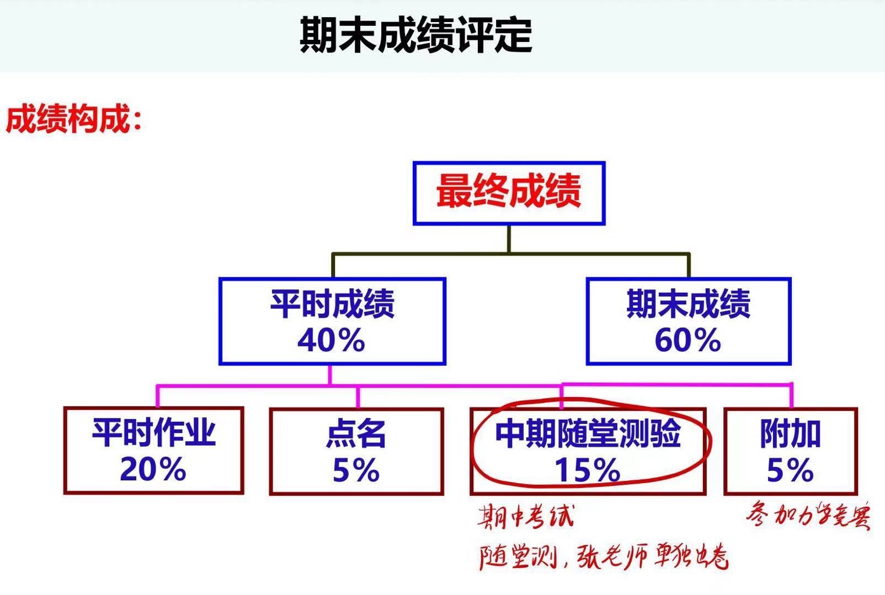
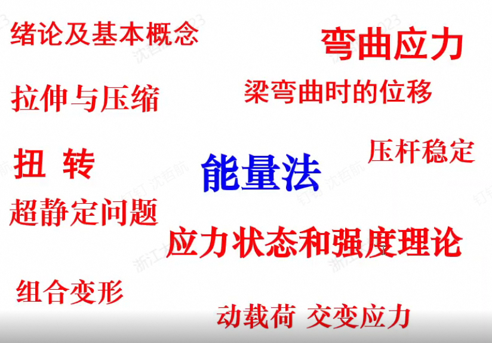
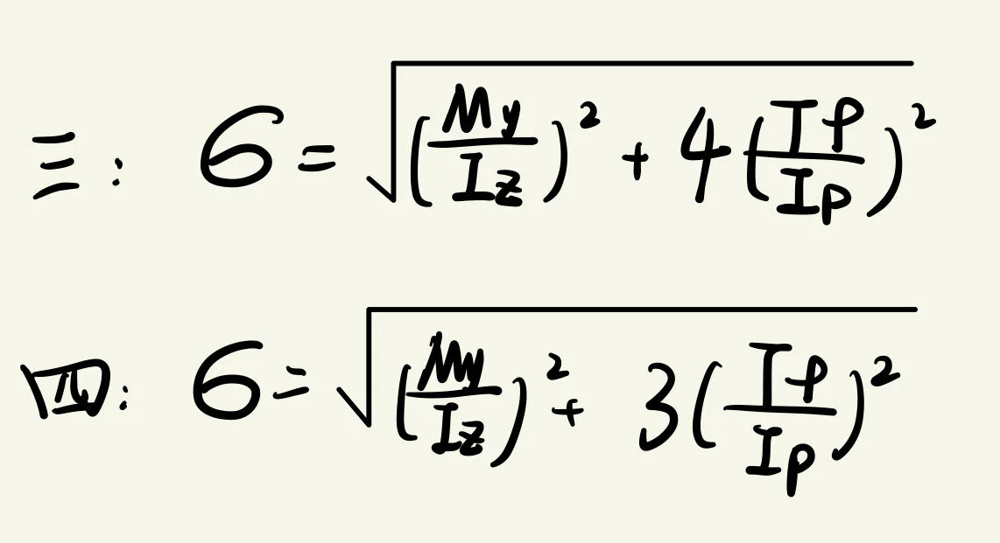

# 材料力学（乙）

> **课程基本信息**

- 学分：4.0
- 开课学期：春夏
- 培养方案建议修读学期：大二春夏

## 历年卷

[24-25春夏回忆卷（整合）](https://www.cc98.org/topic/6210990)

[23-24春夏回忆卷（重排）](https://www.cc98.org/topic/6211387)、[23-24春夏回忆卷（原帖）](https://www.cc98.org/topic/5918995)

[22-23春夏回忆卷](https://www.cc98.org/topic/5634066)

[四份古早的历年卷](https://www.cc98.org/topic/4965918)

## 笔记与整理

[绿色小狗的笔记](https://www.cc98.org/topic/5918851)

[atri的笔记和公式汇总](https://www.cc98.org/topic/6211395)

[Brent的笔记](https://www.cc98.org/topic/6235016#2)

[VoidMiner的笔记](https://www.cc98.org/topic/6226339)

## 经验之谈

### 纸鹭（24-25春夏）

> 原帖略

理论力学研究的对象是刚体，自身不会发生形变，因此无法解决超静定问题。而材料力学就要考虑形变问题了，通过变形协调方程等，可以在理论力学的平衡方程的基础上构建补充方程，因此可以解决超静定问题。材料力学的内容大致可以分为四个部分：

* 第一部分，**拉压、剪切、扭转、弯曲** 是材料力学研究的四种基本变形，这部分就是以孤立的视角分别研究这四种基本变形，一般是春学期上完，张文普老师的期中小测就是考这部分内容
* 第二部分，引入 **应力状态和组合变形**，综合分析材料的变形情况
* 第三部分，用 **能量法** 解决问题，包括卡氏第一定理、卡氏第二定理、单位载荷法、图乘法等，尤其是与 **超静定问题** 结合的时候，能量法可以散发其魅力
* 第四部分，压杆稳定、动载荷、交变应力等，本身不是什么很大的知识点，理解难度也不高

这门课的内容还是比较多的，平时多花点时间认真学吧，尤其是作业题得好好做。期末考试重点考察后面三部分，因为 **后面三部分的综合性比较强**，如果第一部分的四种基本变形没掌握的话，后面的内容大概率也听不懂。力学这种东西向来是比较硬核的，所以需要一定的做题量来支撑。这次我没怎么刷历年卷，考试感觉还行，**功在平时** 吧。

关于这次期末考，我不妨多说几句。首先题型是选择题（7×4=28）和解答题（16+16+20+20=72），考试形式是 **闭卷**。听说早期的材料力学是半开卷，可以带一张A4纸，但最近几年都是闭卷。另外，**今年还不允许带计算器**，其实也不必带计算器，因为试卷里没有需要数值计算的题。选择题比较简单，容易满分；解答题计算量比较大（没错，字母式的计算量同样很大，丝毫不亚于高考数学的圆锥曲线），比较费时间。详细内容看回忆卷吧。

### haaaaaland（24-25春夏）

> **[查看原帖](https://www.cc98.org/topic/6232867)**

**成绩构成**：

**课程主要知识点**：

对于材料力学这门课，与理论力学还是风格很不同的，对我来说可能更好学，说通俗点就是背公式、运用公式。我基本上每节课都去课堂坐在第三排的固定位子上，跟着噗噗的思路学习每一部分的内容，然后我个人的感觉就是每一节课最终会推导出一个核心公式，然后你只要会运用公式解决问题就行了哈哈。然后这门课的困难之处就是知识点比较多，易混淆，尤其是前半部分在讲四大基本变形的时候（拉压，剪切，扭转，弯曲），基本上所有人都会有点懵逼，因为都会有变形，正应力，切应力，反正一堆就很容易搞混。但是到后面你多做题老师上课多加深印象自然会清晰很多。

**知识点的梳理**：

这门课一开始要学习四大基本变形：拉压、剪切、扭转、弯曲。之后有几大板块，出成大题来考察：

1. 应力应变分析（应力圆，二向应力状态），四大强度理论，广义胡克定律
2. 组合变形（包括拉弯组合变形，偏心压缩，截面核心（会考小题，今年明确不考），扭弯组合）
3. 压杆稳定（欧拉公式，等效长度那张表格必背，柔度）
4. 动载荷（动菏因数 $K_d$ 的公式必背，动静法）
5. 能量法（重中之重，重难点）（卡式定理，虚功原理，单位载荷法，图乘法，精通其一即可，殊途同归，我是卡二的坚定支持者）
6. 超静定问题（对称结构、反对称结构降低超静定的次数）

一般都是这六大板块其中两个板块结合在一起考大题，比如今年最后一题是超静定问题，用能量法来解决。

期末卷参照上面的回忆卷即可，一般是7道选择题4分一题28分，计算题4道共72分。

张老师无比的好，我从理论力学甲就跟着噗噗在学习了，材料力学张老师教的也是无可挑剔，怎么会有这么好的老师呀~ 也欢迎大家去噗噗答疑版与老师交流力学问题！[张文普老师答疑版面](https://www.cc98.org/board/789)

最后，想鼓励后面看这个帖子的学弟学妹们，这门课在学习时候可能确实感受到内容繁多，容易混淆，但是最终你熬过来之后，你会发现其实它是很清晰的，你在一开始复习时候可能觉得这*课咋是闭卷的啊，要背的公式那么多，其实到最后也就那么几个重点的公式需要记忆而已。

### Brent（24-25春夏）

> **[查看原帖](https://www.cc98.org/topic/6235016)**
> 
> 编者注：原帖2L有lz的笔记，前文“笔记与整理”中的链接就是指向2L的

**课程**：赵沛老师的讲课水平很高，课堂也非常生动，可以说是我这一学期听的最认真的课了。材料力学的内容比较多，前后的串联性也是比较强的。平时会有一次开卷的期中测验，题目还是非常简单的。不过老师布置的作业非常多，差不多写了两个学校发的作业本了（真的非常多，特别是有的题，一道题目里面有5、6副图，每副图都得进行分析，非常繁琐）。题目的答案网上就有，写的也是非常好。

**考试**：考试的时候前面是选择题，后面是大题，大题的计算量非常大，不能带计算器（所以一般都是直接带字母的），所以在平时做作业还有复习的时候都要多算一算挠度、能量法这些积分，在考试的时候才能算对。前面的选择题还是比较简单的，主要考察的还是基础概念的理解，和一些基础公式的推导。大题的难点还是在于超静定问题和能量法。

**学习**：课程的内容比较多，前后的关联度比较高（但是拉压弯扭分的还是比较开的），不过学了后面之后主要就是使用后面的方法解题了，前面的只是辅助（辅助受力分析）。重点在于弯曲，拉压、扭转后面只是弯曲的附加，剪切更是完全不考虑了。所以前面练习计算，打基础，复习时重点理解后面的内容。

### 小张鱼丸（24-25春夏）

> **[查看原帖](https://www.cc98.org/topic/6229302)**

这门课的话是40%的平时分 + 60%的期末考试，平时分基本上就是作业和点名，之前说有一次小测但好像老师忘掉了，总之这门课还是值得好好学一学的，李学进老师上课相对来说速度比较慢，作业也相对少很多，上拉压和扭转的时候可以相对放松一些，但是到弯曲开始需要紧跟上了；李德昌老师的话上课速度比较快，喜欢点名，作业有时致死量，但是上课还是不错的，弯曲以后的内容基本都是他上，能量法啥的也是。对于期末复习的话lz建议公式一定要背熟，然后能量法里面只需要精通一种方法就可以（lz喜欢用图乘，lz的有几个朋友热衷于莫尔积分），两个人方法不一样还可以检验一下。

材力的话lz建议平时就认真跟上，期末可以去蹭一下隔壁张文普老师的线上复习课，还是不错的，**期末建议复习时间为2d**（不要压的太死，lz以为自己会了，考前两天开始复习发现很多没有搞明白）。

附上lz朋友提供的笔记。**（请参见原帖）**

### 爱看侠岚吗（24-25春夏）

> **[查看原帖](https://www.cc98.org/topic/5929617)**

这门课实在是学的很糟糕，当做反面案例。首先一开始自己是跟上课程的，但是下课后直接动手做作业是做不出来的，于是又要自己花时间重新看一遍PPT，导致后面也不是很愿意听课了，落下几节课后，就更不是很想听了。后面补天的时候，首先是写老师的作业，做的时候首先是自己想，想不出来了就去看答案，在这个过程中，就给了自己学懂的假象。期末考试的选择题中，大部分都是对概念的真正把握，老师上课应该是强调过的，但奈何上课没听，还有lz考试前一天，再次复习，就发现好多好多概念自己弄的很混乱，那些拉伸、旋转、弯曲的公式，64 32D三次方 D四次方，自己完全记混了，所以考完就知道自己炸了，差点就要挂了。忠告就是：最好跟上老师的课程，概念一定要好好地、彻底地把握住，作业题过一遍，但一定要自己做，且最好在考试前做，考试前太久，可能就忘光了（lz就是一个极其惨痛的案例）。

### 笔蔓越莓莓（23-24春夏）

> **[查看原帖](https://www.cc98.org/topic/5933906)**

李学进老师和李德昌老师都很好，我刚开始看名字以为是两兄弟，后来发现长得根本不像。春学期较为基础的部分是李学进老师上的，上课进度较慢，比较适合我。夏学期是李德昌老师上的，上课进度飞快，内容是基于春学期学习内容的更深层次的知识，我上课开始听不懂了，往往只能跟上一节课，不懂的地方都是靠做课后习题弄懂。所以说掌握春学期内容非常非常重要。

平时40%，期末60%。春学期会有一次小测，内容很简单，开卷。平时作业我都是直接搜题抄的，但是一定要弄懂。会有两三次签到。最后大部分人平时分都给满了。

期末考试前我买了蓝田文印店和学解的历年卷，题型又老！又没有答案！！因为材料力学的期末复习我哭了两遍（唉，当时压力真的大啊），好在我们老师最后一节课讲了2022年的历年卷，给我吃了个定心丸。学弟学妹们也可以看对应智云（2023-2024春夏 材料力学（乙） 李学进 2024-6-13）。

最后复习我根本找不着头绪，就通过搜题把历年卷的选择题做了一下。没想到考试的时候考到了不少知识点。除此之外我完完整整地做了2020年的历年卷，但由于没有答案，于是跟室友约定一起做，做完对答案（室友后来也满绩了）。做完一套历年卷信心足很多（我终于不用半夜偷偷哭了），所以一定要做！！做不出来就找之前的作业题重新做一遍，弄懂了学会了再把大题独立写出来。然后我把PPT粗略过了两遍。后来我发现复习重点不是PPT，而是做题，但是PPT不看的话题也做不出来。

我们当时考试的回忆卷可以看这个，这位同学写得非常非常详细

> 2023-2024学年春夏学期材料力学（乙）回忆卷（详细版）https://www.cc98.org/topic/5918995 

我们这次考试七道选择题，第一题是材料力学实验的知识点（强化阶段有弹性变形+塑性变形。卸载之后重新加载，曲线一致）。正应力单元体之前都是放在大题做的，但是这次变成了第二道选择题。拉伸压缩剪切扭转弯曲重点公式都要熟练掌握，不能有一点概念模糊。我们就考了两道形变（扭转角，应变）大小比较和应变能和应变能密度的选择题。注意，只有扭转用到的是极惯性矩，其余用到的都是惯性矩。因为 $\rho^2=y^2+z^2$，所以 $I_p=I_y+I_z$，对于圆形截面来说，极惯性矩是惯性矩的两倍。这个知识点非常重要，让我所有公式都不至于混淆。还有能量方法的几大公式（功的互等定理，卡氏第一定理，卡氏第二定理，虚功原理，莫尔积分）能否用于线弹性变形体。之后还考了动载荷大小判断（有的时候会考大题），相同力的情况下，杆件越“硬”，动载荷越大。最后一道选择题是叠加法求弯曲变形，也就是上册书的表6.1。我没有背表，直接用了单位载荷图乘法考场上推。推出来也挺快，而且自己推比较确定。

大题往年第一题都是画应力图和弯矩图，这次没有，但是后面的大题做题过程中有画到。第一道大题是超静定问题，第二道是一个弯扭组合的机构，第三道是一个简支梁与二力杆组合的机构，判断压杆稳定，第四道是用能量法求开口A、B的相对位移。【详细题目见回忆卷】

这里分享一下我的学习心得。一般来说我不喜欢记公式，所以正应力单元体我一般都用图解法（公式能背下来是最好的了），组合变形下算应变我都是用图乘法。这里知识点没掌握好的建议去做一下作业题，一般做几道就能回忆起来了，大题单位载荷图乘法用的很多，一旦掌握了，大题就会很得心应手。有一个知识点我复习没复习到，老师复习课提到了，我觉得还挺重要，每年都会考。就是第三强度理论和第四强度理论的公式，第三强度理论公式里是4，第四强度理论公式里是3。

