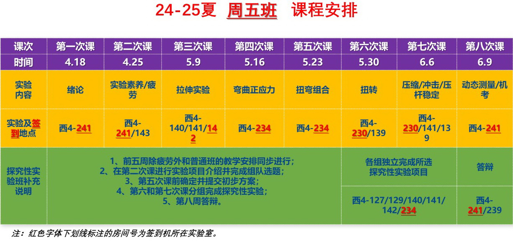

# 材料力学实验

> **课程基本信息**

- 学分：0.5
- 开课学期：冬、夏
- 培养方案建议修读学期：大二夏

> 这门课分为普通班和创新班，普通班是7次实验 + 5次报告 + 机考（10%），创新班是3次普通实验 + 3次报告 + 探究性实验（含答辩）

## 历年卷

[25-26冬回忆卷（一）](https://www.cc98.org/topic/6387197)

[25-26冬回忆卷（二）](https://www.cc98.org/topic/6387782)

[25-26冬回忆卷（三）](https://www.cc98.org/topic/6387965)（含报告参考）

[25-26冬回忆卷（四）](https://www.cc98.org/topic/6392914)

[24-25夏回忆卷（一）](https://www.cc98.org/topic/6209258)

[24-25夏回忆卷（二）与历年题整理](https://www.cc98.org/topic/6206413)

## 经验之谈

### 纸鹭（24-25夏，创新班）

> 原帖略

这门课分为普通实验班和创新实验班，选课时不告知，正式开课后才会告诉你这个班是普通实验班还是创新实验班。两个班的区别如下：

- **普通实验班**：绪论 + 实验素养 / 疲劳 + 拉伸 + 弯曲正应力 + 扭弯组合 + 扭转 + 压缩 / 冲击 / 压杆稳定 + 动态测量 / 机考。共7次实验，5份实验报告(90%)，1次机考(10%)
- **创新实验班**：绪论 + **实验选题** + 拉伸 + 弯曲正应力 + 扭弯组合 + **创新实验** + **创新实验** + **答辩**。共3次普通实验，3份实验报告，1次创新实验（第二周组队选题，第五周前确定初步的实验方案，第六周和第七周完成探究性实验，第八周答辩，要写大论文）

相比之下，创新实验班的任务量更大，且需要课外花时间来完成创新实验。不同选题的难度不同，课外需要花的时间自然也不一样。**所有创新实验都避不开贴应变片和使用应变仪的问题**。创新实验要自己设计实验方案，这意味着应变片需要自己贴，应变仪的接线方式也需要自己设计，不再像普通实验一样可以按部就班地做，这意味着你 **必须理解应变仪的各种桥接方式是什么意思**，所以绪论课的ppt很重要。

这学期有五个创新实验班，其他都是普通实验班。观察发现，这学期的周一和周四因为假期不补课导致只有七周，而五个创新实验班都避开了周一和周四，所以......别看我，我什么都不知道哦。~~（0.5学分闹麻了）~~

### haaaaaland（24-25夏，创新班）

> **[查看原帖](https://www.cc98.org/topic/6232867)**

0.5学分的课也是闹麻了（恼）。以上为课程安排，建议避开创新班。

第一次课为绪论，讲解理论部分，建议好好听（虽然大家都很难好好听）。之后几节课为三次普通实验，需要以小组形式完成实验报告。创新班最后两次课独立完成创新实验，建议谨慎组队，因为遇到好的队友可以避免很多不必要的麻烦。最后一节课需要答辩并上交实验报告（科研论文格式书写）。主要的授课老师有三位：王双连、张伟根、佘文轩。佘老师比较年轻，也比较好相处，遇到不会的可以问他；王老师不是负责我们班的，但在创新实验部分也给我们许多指导；最后是张老师，可能比较严格，但是你好好问他他也是愿意提供帮助的哈哈，有种恨铁不成钢的感觉。

实验报告可供参考（**见原帖**）。

### XSYangtuo（24-25夏）

> **[查看原帖](https://www.cc98.org/topic/6240336)**

每个老师都教的挺认真的，但是早八对我来说还是有点太痛苦了。每次实验的组队（2-3人）都是自愿随机的，只要保证组里有一个知道如何操作就可以了，然后推出一个人来写实验报告这样子。实验的精度还挺高的，线性相关度常常达到0.9999，还挺让我惊叹的。

这门课学到的最重要的工具是应变片测量应变，以及各种电桥的接法（我周赛的时候就因为这个没有学懂导致一整题都做不出来，这就是早八不听课的报应啊，考后痛定思痛整了个明明白白）。以及这个也是最后机考的一个考核难点。其他基本上都在书上可以看到，这个是需要一定的理解能力的。

机考是开卷的，而且几乎决定着你最后的绩点（虽然这么点分也没啥用）。

### 小张鱼丸（24-25夏）

> **[查看原帖](https://www.cc98.org/topic/6229302)**

这课欺负lz和lz的队友字丑吧应该是（笑死）。

这门课期末机考10% + 实验报告90%，实验报告一般两到三人完成一份，任务量比较小，但是我们仨的字各有各的抽法，放一起应该更不行。主要讲机考吧，机考开卷，可以带书，但是书也基本没用吧，找不到，lz还是给大家整理了一点资料（**见原帖**），是每次实验老师给的实验原理，大家也记得去看别人的回忆卷，题型很类似的。

### 华火（24-25夏）

> **[查看原帖](https://www.cc98.org/topic/6228944)**

材力实验分为创新班和普通班。普通班做六个实验 + 一个上机开卷不能用手机的考试；创新班前四个实验正常做，后两个实验不做，没考试，改做一个创新实验，并于最后一周答辩。

实验都挺简单的，注意每次实验都需提交一次实验报告，2-3人一组，只需交一份报告，分数一组人平分，所以可以轮流写报告。

给分据说普遍不是很好，只占0.5学分，记得把实验报告都交了问题就不大。
