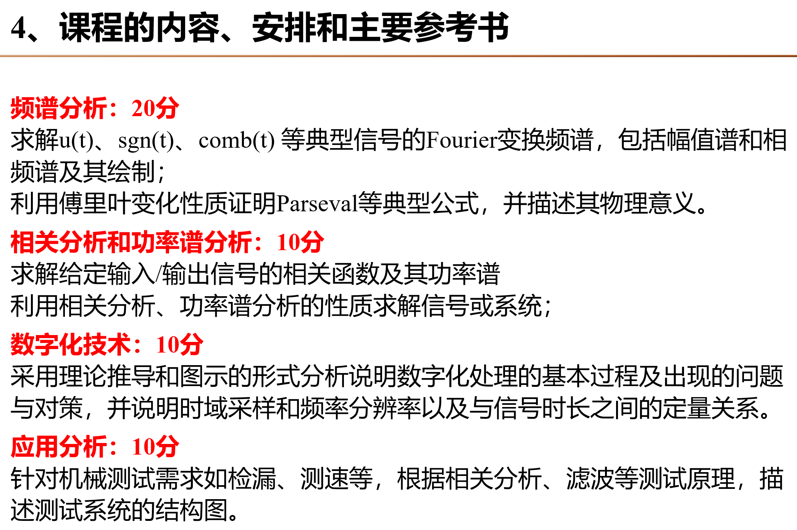
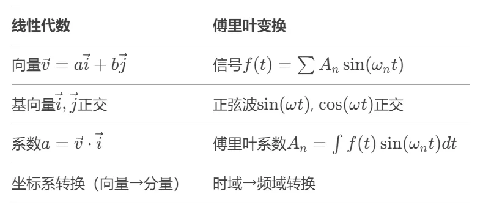

# 机械工程测试技术

> **课程基本信息**

- 学分：2.0
- 开课学期：秋
- 培养方案建议修读学期：大三秋

## 历年卷

[25-26秋回忆卷](https://www.cc98.org/topic/6344727)

[24-25秋回忆卷](https://www.cc98.org/topic/6326483)

[纸鹭出的一份模拟卷](https://www.cc98.org/topic/6344222)

## 笔记与整理

[cast1e的笔记](https://www.cc98.org/topic/6343247)

[阿晴晴的笔记](https://www.cc98.org/topic/6343660)

[NeroShiki的笔记](https://www.cc98.org/topic/6031785)

[祈凛的笔记](https://www.cc98.org/topic/6031620)

[绿色小狗的资源整理](https://www.cc98.org/topic/5989952)

---

## 经验之谈

### 纸鹭（25-26秋）

首先是期末考的题型：10分判断（每题1分），40分填空（每空1分），50分大题。具体题目可以看回忆卷。

至于备考，总结下来就是两个词： **背书 and 默写** 。你可能会问：不是还有50分的大题吗？事实上，这50分大题也是默写。考题基本上都是明盘的，就看你愿不愿意背了。比如相关分析的应用（检漏、测速、滤噪）、典型函数的 Fourier 变换、Fourier 变换的性质及其应用、数字化处理的那张图和四个问题及对策等。

剩下50分就是一堆概念，需要熟读成诵，背诵量和工程材料相比还是太亲民了，但是依旧需要花不少的时间。复习的时候比较痛苦，不过在考场上可以行云流水。

同样的，有一份[模拟卷](https://www.cc98.org/topic/6344222)，考完发现还是命中了几道题的（喜）。

### 笔蔓越莓莓（24-25秋）

> **[查看原帖](https://www.cc98.org/topic/6110866/2#4)**
>
> 编者注：第一张图片经过换源，原帖中部分用图片展示的公式改用 Markdown 渲染

朱吴乐老师是居冰峰老师的学生。第一节课居老师来上了一次导论，之后都是朱老师了。没有点名，没有小测，给分也很好。但是朱吴乐老师上课声音有点小，就比较催眠。

期末考试70%，平时作业20%，课堂成绩（出勤等）10%。考试内容如下：

最后一节课的时候老师会讲一个复习大纲，每一年的复习大纲都不太一样，由此推测复习大纲对应的应该就是期末考的大致范围。复习大纲老师不会发给同学，所以就需要从智云上一帧帧下载整理。听说陈章位老师班的小测题里有很多期末考题，但是陈老师给分极烂，我就是从陈退课补选到朱/居的，所以没有去向陈老师班里的同学要小测题，如果到时候陈老师还没退休的话学弟学妹们可以考虑问一下他们班里的小测题。

推荐这份历年卷，感谢8u整理！

> [2024秋机械工程测试技术 一点考卷回忆](https://www.cc98.org/topic/6032034)

测试技术一个比较需要理解的重点就是傅里叶变换。当时我这里就搞不懂，刚好碰上信息工程的同学，就向他请教了一下，感觉茅塞顿开。除此之外剩下的内容要么是基于傅里叶变换要么就比较好理解，要对着复习大纲做做题。大题一定要上手练！不然考试的时候很难写出来。在这里写一下傅里叶变换的理解方式：

假设有一段复杂的信号（比如一段音乐），傅里叶变换能将任意复杂信号分解成多个不同频率的正弦波（像乐高积木一样的基础波形）。时域是信号随时间变化的图形（比如心电图显示心跳随时间起伏）。频域是信号分解后各频率分量的“强度分布图”（类似音乐频谱显示高音、中音、低音的比例）。傅里叶变换能将时域信号在频域上的表达表示出来。如果信号是时间函数 $f(t)$，傅里叶变换会把它转换成频率函数 $F(\omega)$。公式简写为

$$
F(\omega)=\int_{-\infty}^{+\infty}f(t)\text{e}^{-\text{i}\omega t}\text{d}t
$$

所以说为了进行傅里叶变换，要将 $f(t)$ 分解成多个不同频率的正弦波，从而进行“加权求和”，计算信号中每个频率 $\omega$ 的贡献强度。众所周知（欧拉公式）

$$
\text{e}^{\text{i}x}=\cos{x}+\text{i}\sin{x}, \space \text{e}^{-\text{i}x}=\cos{x}-\text{i}\sin{x}
$$

所以傅里叶变换本质是用正交的正弦波作为“坐标系”分解信号，就像用直角坐标系的 $x$ 轴、$y$ 轴分解向量一样。线性代数中用 $\boldsymbol{i}, \boldsymbol{j}$ 作为基，函数空间中用正弦波 $\sin⁡(\omega t), \cos⁡(\omega t)$ ​​作为基。为什么用正弦波，关键原因就是不同频率的正弦波满足正交性（两两相乘积分为0）。

测试技术内容太多太杂，一定要对照老师给的的复习大纲和作业题进行复习。孔伟杰学长的知识点整理也很有用！

### 八抄（22-23秋）

> **[查看原帖](https://www.cc98.org/topic/5465055)**

lz上的是杨克己老师班的课，今年的试卷似乎也是他出的（不过今年老师好像就要退休了，所以今年的经验只是一个参考的意见）。总体来说需要背的很多，计算题很少，需要的计算上课都有给出例子，感觉直接背出比考试现场推的性价比更高。

是一门需要背书的课！一定要背书！该背的划过重点的一定要背。计算题反而是次要的（个人理解）。