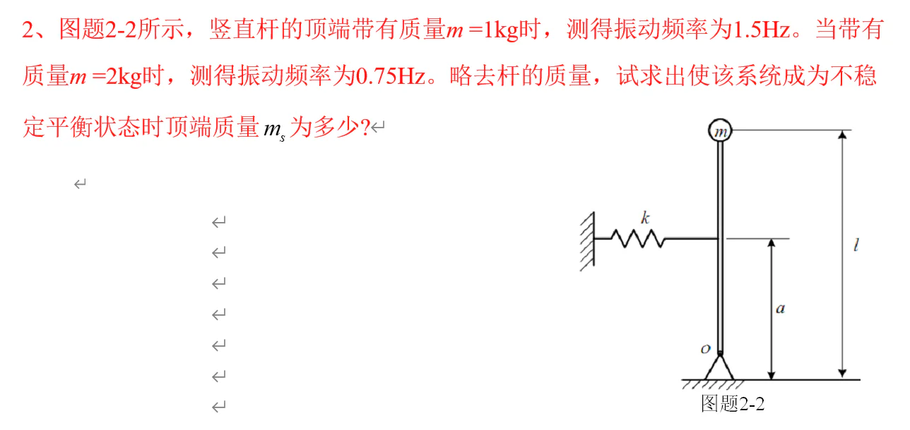
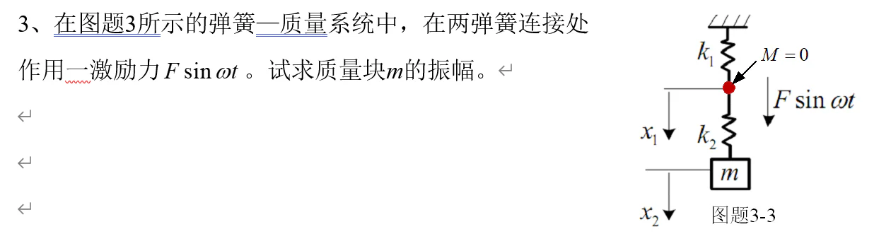
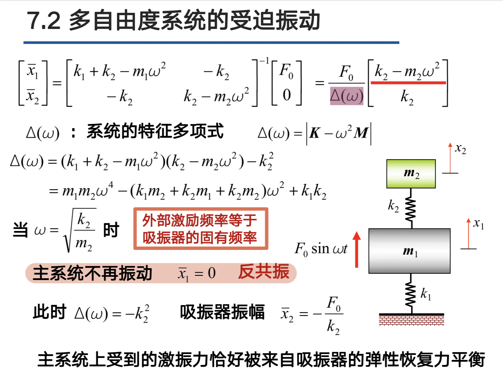
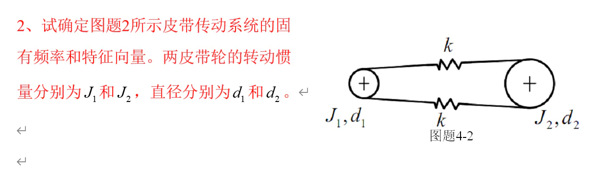
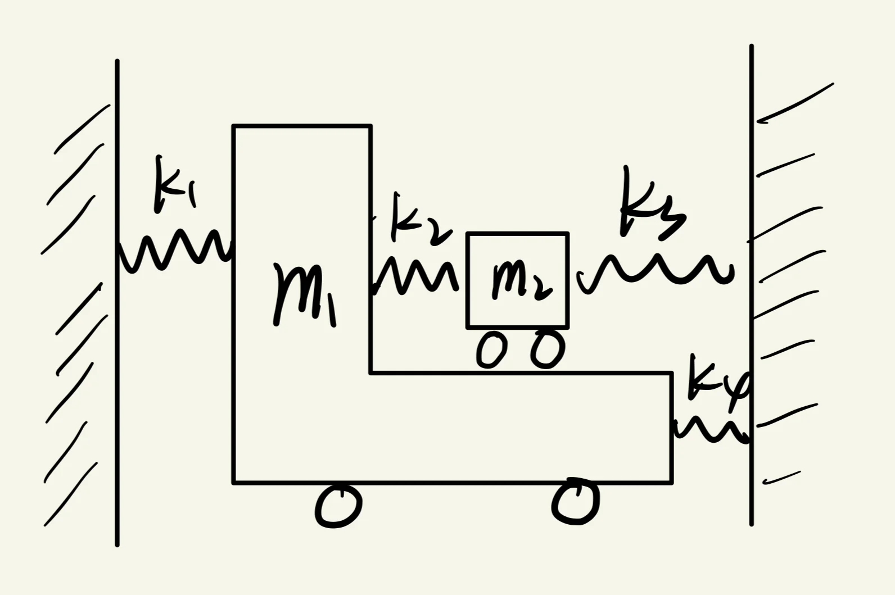

# 机械系统动力学

> **课程基本信息**

- 学分：1.5
- 开课学期：春
- 培养方案建议修读学期：大三春

> 暑期开设了同名的国际化课程

## 历年卷

[24-25春回忆卷](https://www.cc98.org/topic/6160918)

[23-24春回忆卷](https://www.cc98.org/topic/5876960)、[atri的参考解答](https://www.cc98.org/topic/6158886)

[21-22春回忆卷（一）](https://www.cc98.org/topic/5313072)、[21-22春回忆卷（二）](https://www.cc98.org/topic/5307417)、[atri的参考解答](https://www.cc98.org/topic/6159707)

## 笔记与整理

[绿色小狗的复习整理与PPT习题整合](https://www.cc98.org/topic/6159894)

[atri的复习提纲](https://www.cc98.org/topic/6157920)

## 经验之谈

### 关于暑学期的国际化课程

#### 学院官方通知

- [机械工程学院关于暑期海外教师主导本科全英文课程的开课通知--《机械系统动力学》](http://me.zju.edu.cn/meoffice/2025/0529/c6427a3056499/page.htm)（2025年暑期）

省流：平时作业 + 小测 + 期末考试 + 大作业

#### 一些讨论

原帖：**[讨论帖1](https://www.cc98.org/topic/6199755)**、**[讨论帖2](https://www.cc98.org/topic/6197793)**、**[讨论帖3](https://www.cc98.org/topic/5905147)**

总结：

1. 褒贬不一，但好评居多；
2. 上课时间是晚上，如果与《工程拓展训练》重合的话会非常痛苦（白天干活，晚上上课，时间太紧）；
3. 多数认为考试简单且给分不错（编者身边上过这门课的都说给分好）；
4. 正常百分制，不是五级制。

### 笔蔓越莓莓（24-25春）

> **[查看原帖](https://www.cc98.org/topic/6229120/1#3)**

陈远流老师很帅，而且年轻有为啊！

《机械系统动力学》平时成绩占比30%，闭卷考试占比70%（这个比例存疑，但考试确实是闭卷），教材是《机械振动学》，上课内容不一定能在书本上找到，所以最好是看着老师往年的PPT学，往年的PPT可在孔伟杰学长的公众号里找到。

机械系统动力学的资料很丰富，尤其是atri的复习提纲和期末卷个人参考答案很有用！（而且atri是23级学生，提前修了机械系统动力学，造福了我这位22级的老登）

接下来我讲一下考试的感受，可对照2024-2025学年回忆卷看~

简答题个人感觉很难，如果单凭自己对着PPT复习的话不太能答出来，但是好在每年的简答题都大差不差，因此把历年的每一道简答题掌握了，上考场就心里有个底了。我当时简答题基本是没有卡住，一直往下写的，但还是写了将近四十分钟，感觉时间很紧。主动隔振、被动隔振、阻尼吸振器是陈远流老师反复强调的考点。

第一道大题求解固有频率，还问你 $m$ 大于多少时会失稳。类似于下图。我平时用的都不是能量法，结果发现这道题不用能量法求固有频率比较难求且容易出错。失稳的情况就是此时的重力力矩大于弹簧力力矩。

第二道大题求振幅，类似于下图。其中很重要的一点就是要把 $M$ 看成一个质量为 0 但是很有存在感的点。

同样不是常见的方法，我用了下图这个公式。

第三道大题跟作业题很像，但是改了点参数，导致出现了多自由度系统的零根情况，我验算了几遍才敢继续写上去，不过还好题目并没有很深入地讨论这个零根情况。类似于下图。

第四道大题比较难，跟往年的单纯确定特征向量及模态矩阵不一样，除了求微分方程和固有频率外，还有一小题是求稳态响应，也就是位移 $x$ 的方程。类似于下图。

### 明玲玉珑（24-25春）

> **[查看原帖](https://www.cc98.org/topic/6228452#9)**

**考核方式/应试**：祝毅老师平时不点名，但会对着名单点人回答问题，也就是抽查型点名，没到的话会扣分。

这课是理论型硬课，有作业和闭卷考试，内容涉及受力分析、复变、微分方程、线代等，平时好好上课，作业不管是做还是抄（搜不到的可以问DeepSeek，有的题它是真会），要理解一下（不能理解也要硬记做题套路，我就是这样的），最后好好复习一下作业题、PPT，过肯定是没问题。

**上课体验**：老师讲得还不错，认真听是能跟上的（我是真的没法全程集中精力，渐渐地就落下了orz）。

### 只因蟹（23-24春）

> **[查看原帖](https://www.cc98.org/topic/6129809)**

个人认为是机械几门能学到东西的课之一，同时也是夏令营/复试容易被问到的课（上交机械夏令营就被问到了隔振方式，lz答的稀碎，引以为戒hh）。课程总体难度不算大，上课认真听的话能跟上，zy老师讲的还是挺好的。作业需要花一点时间，但是是值得的，作业认真做后面准备考试会容易很多。

### 幻影光临（21-22春）

> **[查看原帖](https://www.cc98.org/topic/5233123)**

十个简答题，四个大题。大题难度明显低于平时作业，最多只考了两个自由度的受迫振动，而且大题都是不带阻尼的。

第一个大题考了一个浮力的问题，形式上等价于最简单的弹簧物块系统的微分方程，求固有频率，考察的是单自由度自由振动内容。

第二个大题单激励单自由度受迫振动，计算振幅，题型和陈远流老师给的PPT里的那个小车过一个正弦坡的题一模一样。

第三个大题考的是两个板分别通过一根弹簧夹着一个物块，两个板都有位移，算两个激励的单自由度受迫振动，计算稳态响应。

第四个大题考两个自由度的受迫振动，质量矩阵和刚度矩阵都在题目里给出来了，求模态矩阵和解耦方程，也很简单。

之前在版上找到的现代机械系统动力学似乎是18级以前机电开的课，感觉跟今年考的机械系统动力学差距蛮大的，我就是参考了那个，以为他会考的比较难，结果出乎意料的简单。

> [2019-2020 夏 现代机械系统动力学](https://www.cc98.org/topic/4958778) 

想了想，这部分都写了这么多了，干脆发个回忆卷吧。

> [2021～2022春学期《机械系统动力学》回忆卷](https://www.cc98.org/topic/5307417)