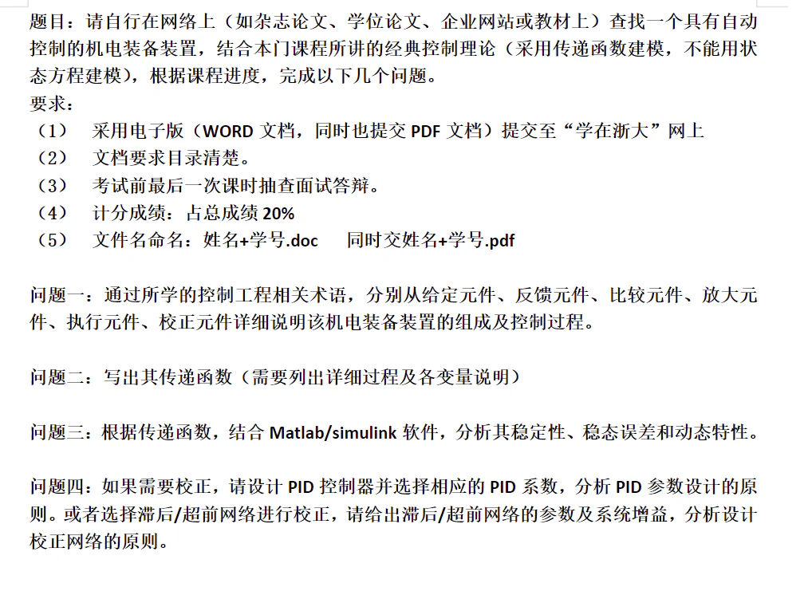
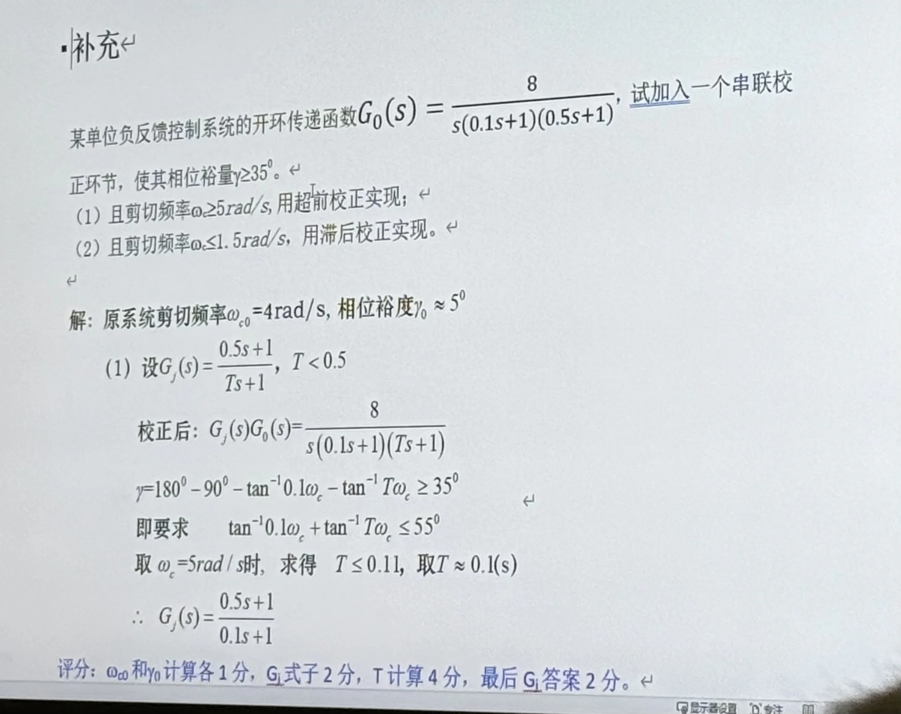
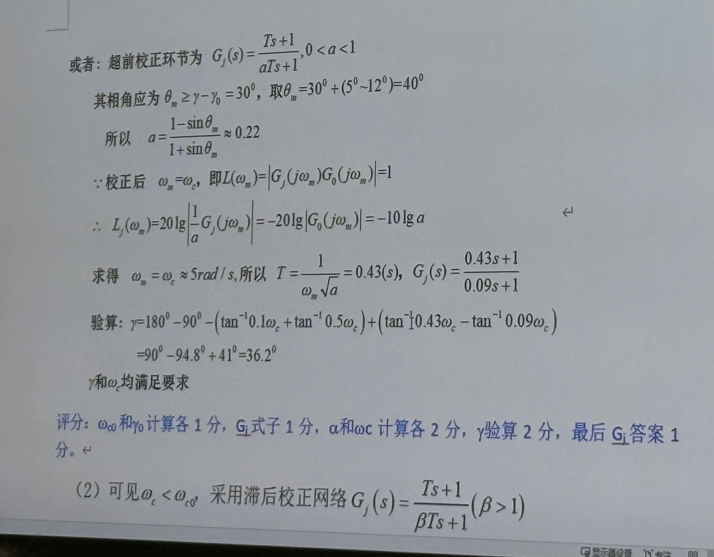

# 控制工程基础

> **课程基本信息**

- 学分：2.5
- 开课学期：秋
- 培养方案建议修读学期：大三秋

## 历年卷

[25-26秋回忆卷](https://www.cc98.org/topic/6337664)

[22-23秋、23-24秋、24-25秋的历年卷重构](https://www.cc98.org/topic/6334100)

[纸鹭出的一份模拟卷](https://www.cc98.org/topic/6336770)

## 笔记与整理

[《控制工程基础》第四版课本](https://komeijiren.lanzn.com/ixnyu3awdqqb)

[《控制工程基础》第四版课本习题解](https://komeijiren.lanzn.com/ink4A3awdr9a)

[阿晴晴的笔记整理](https://www.cc98.org/topic/6335469)

[atri的补天提纲](https://www.cc98.org/topic/6337661)

[绿色小狗的知识点整理](https://www.cc98.org/topic/6025260)

## 经验之谈

### 纸鹭（25-26秋）

> 原帖略

这门课大概就是学一些自动控制原理，不过没那么深入。考试只有七道大题，这是好事，因为我考完以后做了一下过控专业的试卷，结果被几道概念题制裁了。这印证了 114_514 前辈所言：“出选填可能更荒谬”。

我的老师是朱笑丛老师。仅从这门课而言，朱老师还是非常好的，没有大作业，几乎不点名，且耐心解答提问。cls上一些不太好的评价应该是来自于机电模块的那个课。

然后讲一讲这门课的学习内容吧。这门课的研究对象是机电工程里的 **负反馈控制系统** （所以考试几乎不会出现正反馈），研究工具是 **Laplace 变换及其反变换** （整个课程的研究基础），研究内容是控制系统的 **稳定性、准确性、快速性** （稳、准、快，所以分析系统性质的时候要紧扣这三个方面）。

首先是 **Laplace 变换** ，这是这门课研究的基础。因为在时域里研究控制系统会出现微分和积分，这给我们的研究带来了极大的难度，而 Laplace 变换打通了时域与复数域，将时域里的微分和积分转变为了复数域里的乘除法，后续只要研究多项式和多项式分式即可，极大地方便了我们的研究。

借助 Laplace 变换及其反变换，我们能很方便地解一些时域微分方程（先将时域转为复数域，再将复数域转回时域），得到 **瞬态响应** 。这里，我们研究的是 **快速性** 。

借助 Fourier 变换，我们能将复数域转为频域（只要令传递函数 $G(s)$ 里的 $s=\text{j}\omega$ 就行），以此分析其频率特性。频率特性的研究主要是借助 Nyquist 图和 Bode 图，后续章节会大量使用 Nyquist 图和 Bode 图。

控制系统能在实际中应用的 **首要前提是系统必须稳定** ，系统稳定的充要条件是 **闭环传递函数** 的极点都在 $s$ 平面的左半面。由此，我们有代数判据和几何判据，用来判断闭环传递函数的极点分布，以此判断稳定性。Routh 判据是一种代数判据，它直接对 **闭环传递函数** 的特征方程进行研究。Nyquist 判据和 Bode 判据是几何判据，它们通过研究 **开环传递函数** 的频率特性来推断闭环传递函数的极点分布。所以，这里我们研究系统的 **稳定性** 。

接下来是研究系统的稳态误差，也就是 **准确性** 。需要注意的是， **一个系统必须先是稳定的，而后才能判断其稳态误差** （广为传颂的经典：习题6-10）。

前面已经研究了控制系统的三大特性，随之而来的问题就是，如果一个系统的稳定性、准确性、快速性不能满足我们的要求，怎么办？于是就有了校正。校正这一块的综合性非常强，且难度也比较大，里面还有不少经验公式，需要一定的记忆，更需要多加练习。尤其是 **超前校正** （ **一般法** 或 **相消法** ，两种方法都要会）、 **滞后校正** （$K_\text{v}=\beta\omega_\text{c}$ 与 $1/T=(0.1-0.2)\omega_\text{c}$）、 **高阶最优模型** ，这三个是考试里的常客。另外， **我觉得这一章节的课本习题意义不大，看看过得了，主要还是面向历年卷吧** 。

最后还有一个不太一样的 **根轨迹** ，主要是利用一些性质画出根轨迹图。根轨迹可以用来分析系统的时域特性和稳定性，还可以用来校正（这个不考）。虽然我们因为国庆放假只有七周的课，但根轨迹依旧纳入了考试范围，导致我们班不得不抽一个晚上补了一下课。

考试题目还是挺固定的，现有的历年卷基本上够用了。考前我还完整的出了一份[模拟卷](https://www.cc98.org/topic/6336770)，里面聚集了这门课可能出现的所有 **邪恶的题目** （如框图题的三个质量块、稳定性判断里的延时环节、根轨迹题的主导极点与二级结论分析等）。如果认为自己复习的比较充分，想挑战一下偏难怪的话，可以尝试。

### 笔蔓越莓莓（24-25秋）

> **[查看原帖](https://www.cc98.org/topic/6110866/2#5)**

魏燕定老师感觉有点凶，而且上课会点同学起来回答问题。没有说过成绩占比，但大概是期末考试70%，平时分30%（其中20%是大作业，10%是平时作业）。平时作业推荐买一个《控制工程基础习题解》，大作业要求如下：

我们班大部分做的都是倒立摆，倒立摆参考文献很多。以前都是每个人都要答辩，我们这一届因为多上了一节根轨迹的内容，就变成了8人一组，其中一人展示，另外几位同学帮忙在答辩的时候回答问题，展示的同学加2分。

选了机电模块的同学一定要学好控制工程基础，《液压传动及控制Ⅱ》的伺服阀部分，有很大一部分内容是在控制工程的基础知识上展开的，如果忘了知识的话上课就是云里雾里的感觉（我深有体会），于是考试前我花了一个晚上重新把《控制工程基础》学了一遍，考试的时候（开卷）还带了这本书。

做历年卷很有用，推荐这三份历年卷，感谢8u整理！

> [2024-2025学年秋学期机械学院《控制工程基础》回忆卷](https://www.cc98.org/topic/6025353)
>
> [2023秋控制工程基础（机械）回忆卷 （不完整版）](https://www.cc98.org/topic/5753468)
>
> [2022-2023秋控制工程基础（机械）回忆卷简（不完整）](https://www.cc98.org/topic/5460108)

大家看完三份历年卷后大概就知道题型是差不多固定的（当然之后会变也说不定），强烈建议大家把三份历年卷都做一下，会对考试有一个整体的把握。我下面提到的点基本是历年卷上的点，但不能涵盖整本书的考点，所以更建议大家 **把老师的PPT从头到尾学几遍** 。

第一道大题一般是给一个弹簧阻尼系统求运动微分方程，梅森公式最好要会。虽然老师上课不讲，但是掌握一下还是很好的。我们考的题目跟作业2-19很像，而且求的是 $Y_1(s)/F_i(s)$，不是 $Y_2(s)/F_i(s)$，就不能直接用框图的输出输入公式导出。所以第一道题就卡了挺多人的。除了掌握梅森公式外，我认为还需要掌握一下作业题2-15，弄清楚不同输入不同输出所对应的传递函数，然后你会发现它们的分母都是一样的，就是分子不一样，而分子就是从输入到输出所遍历的框图的乘积（注意正负号），再搭配梅森公式，原本容易搞混淆的第一题就迎刃而解了。

第二道大题一般考察二阶振荡的时域分析性能指标，也就是书本3.4，要熟悉二阶振荡的时域特性曲线，上升时间，峰值时间，最大超调量，调整时间，时域稳定值等等。而且要注意二阶振荡传递函数的分子分母系数，我们考试的时候，我把分母 $s^2$ 前的系数化为1之后，传递函数的分子并不是 $\omega n^2$，而是 $\omega n^2$ 除以了一个 $k$，意味着时域稳定值不是1，相应的，其他时域分析性能指标的计算也相应地发生了一些变化。

第三道大题考察伯德图，包括画伯德图、根据伯德图写传递函数、剪切频率、穿越频率、相位裕量、幅值裕量、开环增益、转折频率等等。这里要注意，开环传递函数和闭环传递函数是不一样的，因为我们常常通过开环的特性曲线来推算闭环是否稳定，所以就忘记了开环伯德图和闭环伯德图其实是不一样的，这个误区很多同学到大三可能也没有发现，因为常常考的都是开环特性曲线，详细的可以看一下书4.6。我们考试中的频域放大10倍，其实就是横坐标移动一个单位。

第四道大题考察稳定性判断，包括伯德图判断，奈氏图判断，求稳态误差。2023秋的回忆卷中传递函数分子为负，这是之前没有见到过的。负增益相当于在系统中加入了一个反相器，即信号的正负极性发生了反转，相当于带来了180°的相移，与往常的做法并不一样。

而2024年秋的第四大题更是有坑，第一个是开环具有积分环节，不可以直接用米哈伊洛夫稳定定理获得极点对应向量的相角变化，而是要用半径趋近于0的半圆在虚轴上极点的右侧绕过这些极点，即将这些极点划到左半 $s$ 平面；二是要画奈奎斯特辅助线，也就是用虚线补全圆弧，而这个内容平时练的很少，老师的PPT上有一些内容，但不是很多，大家可以在学习PPT的基础上自己上网学一下奈奎斯特辅助线补全圆弧怎么做。要注意画的辅助线补全的圆弧也算是奈奎斯特曲线，也算进穿越的判断来源。

第五大题方块图，考察劳斯判据，不同输入下和不同干扰输入下的稳态误差，要注意偏差和误差相差了一个反馈函数，因此要注意反馈函数是否为1。同样的，除了掌握误差分析这一整章内容之外，也要掌握一下作业题2-15。

第六大题校正，一种校正方法有两种做法，姑且称为相消法和一般校正法，过程如图。我为了稳妥，学了很久一般校正法，结果考场上很难算，用相消法反而简单许多。不过还是建议都学一下，毕竟相消法有时也会难算。

第七大题根轨迹。我们当时好像是因为上满了八次课，没有被节假日冲掉，所以考试范围就多了一个根轨迹法，以前是没有的。由于没有交根轨迹的作业，习题解上的解答也极其简略，所以我学得并不踏实。这里我建议对着历年题多看看书，尤其要掌握书本上根轨迹图绘制的举例。