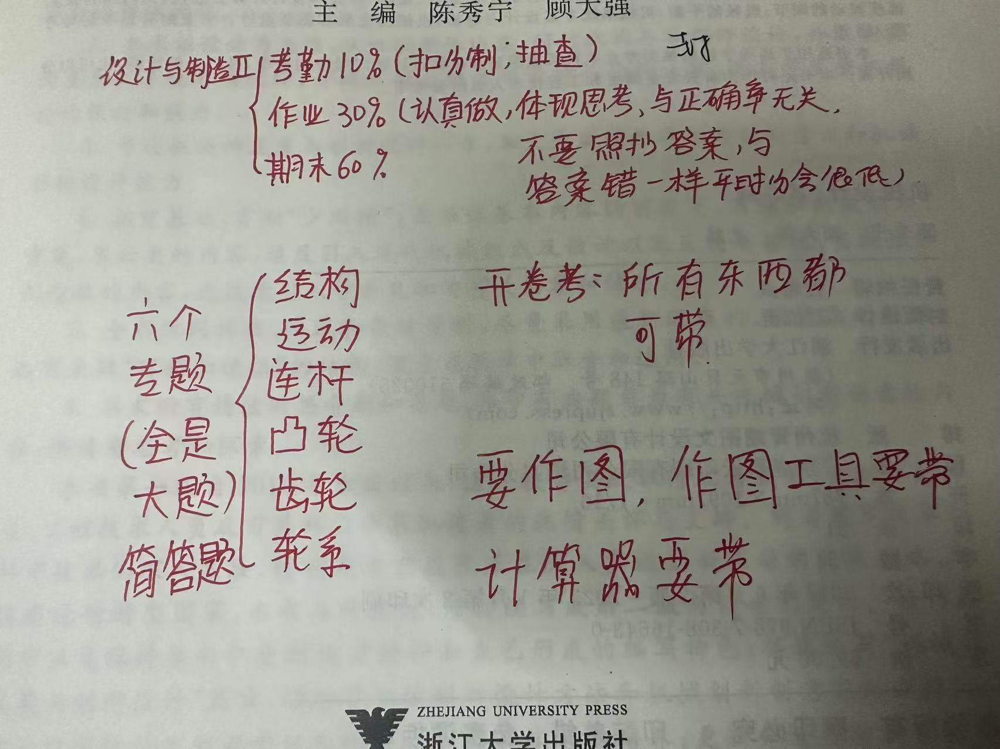

# 设计与制造Ⅱ

> **课程基本信息**

- 学分：3.0
- 开课学期：春夏
- 培养方案建议修读学期：大二春夏

## 历年卷

[24-25春夏回忆卷](https://www.cc98.org/topic/6219138)

[23-24春夏回忆卷](https://www.cc98.org/topic/5917701)

[22-23春夏回忆卷（题干）](https://www.cc98.org/topic/5644335)、[22-23春夏回忆卷（图）](https://www.cc98.org/topic/5644320)

## 笔记与整理

[绿色小狗的复习整理](https://www.cc98.org/topic/6193790)

[纸鹭的习题卡解答（含个人批注）](https://www.cc98.org/topic/6219603)

[atri的开卷资料与速成提纲](https://www.cc98.org/topic/6220797)

## 经验之谈

### 番茄杀西瓜（24-25春夏）

> **[查看原帖](https://www.cc98.org/topic/6409164)**

陈老师是新老师，上课略显生疏，说话很温柔，再加上下午678真的很催眠，不过给分挺好，我的分数一看就有老师的努力。上课进度话倒是比较快，期末也有习题解答课，还给我们讲过他的研究方向，进度比hd老师正常多了。作业期限也一般两三个礼拜，比较合理。

期末考试的话就是结构简化、运动学（一般就是瞬心法）、连杆、凸轮、齿轮。题不算很难，一定要把平时作业搞懂，网上搜索浙江大学机械原理答案即可，开卷考试直接把这份答案带进考场，但是变位齿轮的题一定要听cfy老师的讲解，期末每次考的都是差不多的齿轮计算。如果有什么地方不明白的直接B站大学，因为是考研课，资源非常多。

### 纸鹭（24-25春夏）

> **[查看原帖](https://www.cc98.org/topic/6170207/1#0)**

《设计与制造Ⅱ》其实就是机械原理。考试形式是 **开卷** ， **可以带计算器和任何纸质资料** 。题型是六大板块各一道大题： **结构分析、运动分析、连杆机构、凸轮机构、齿轮机构、轮系** 。课程的主要内容如下：

1. **结构分析**：理清构件、运动副、自由度的概念，掌握自由度的计算、高副低代、拆杆组，辨析复合铰链、局部自由度、虚约束。
2. **运动分析**：主要是 **速度瞬心法** 和 **图解法（矢量法）** 。所谓速度瞬心，就是两个构件上速度相同的点，其中三心定理是关键，经常需要利用三心定理确定速度瞬心。图解法（矢量法）需要 **速度合成与分解** 、 **加速度合成与分解** ，是理论力学中关于运动学的延伸。
3. **连杆机构**：掌握杆长条件，理解极位夹角、行程速比系数、压力角等概念。用图解法设计连杆。
4. **凸轮机构**：掌握反转法，比较好理解。实际情况是凸轮转动，所谓反转法就是让凸轮不动，从动件反方向转动。
5. **齿轮机构**：内容很多，概念很多，公式很多，总之这一块需要花大量时间理解。
6. **轮系**：轮系与齿轮的区别在于，轮系是一系列齿轮互相啮合，要求计算传动比。考试一般都是考复合轮系，既有定轴轮系也有周转轮系。这一块比较简单，不粗心就行，注意正负号。
7. **力分析、机械效率、其他机构**：不考，看看过得了。

### 爱看侠岚吗（24-25春夏）

> **[查看原帖](https://www.cc98.org/topic/5929617)**

算是lz学的比较好的一门，首先这门课和Ⅰ没有很大的关系（至于为什么要说这个，是因为我还没有修过Ⅰ，如果有同学和我情况一样，不需要担心没有修Ⅰ而直接修Ⅱ）。我觉得这门课如果单纯从应试的角度来看，可以靠补天来实现，因为考试的题型是完全固定的，而且还是开卷，六大题型，多看几遍老师的作业题和答案，其实考点很固定，当时我从机构到齿轮都是跟上cfy老师的进度的，讲的比较清楚，但是每次作业都很马马虎虎地感觉看不太懂，也都是抄的。后面一个月都是针对考点，自主到B站上面找的零散的视频。

1. **机构题目**，需额外注意局部自由度、虚约束、复合铰链这三种特殊情况即可，考试时可以带着几个例题看，寻找做题的感觉。
2. **运动分析**，瞬心法，能够直接判断转动副之间的瞬心、移动副之间的瞬心、高副之间的瞬心即可其他的就根据瞬心多边形（在同一条直线上）慢慢找，会用三心定理即可；矢量方程图解法，有点理论力学知识点的运用，我觉得公式列出来，去找已知量，这个题型也很固定；平面机构力分析，期末考试题型中好像出现的较少，我的复习也仅仅局限于死记硬背的层次。
3. **连杆机构**，极位夹角、行程速比系数的运用，关键是会画圆；反转法找点，我的想法是把要找的点固定，然后用全等三角形或四边形的旋转来更形象地理解反转。
4. **凸轮**，凸轮的题型很固定，直动、摆动凸轮，平底、尖底、滚子，核心的理解反转法，我对反转法的理解就是把他还原成一个三角形，用三角形围绕着一个点旋转。
5. **齿轮**，针对这个题型，一开始想着直接套公式，但是写题的时候，发现概念、字母代表的意思完全不明白，公式要找很久，于是先看了一个B站视频，了解了概念，这样的话考试能找得到公式，这次期末考试的题目和作业题有一道非常相似，直接把数据改一下即可（我看题目是这么觉得的，不过不知道我是不是对的）。
6. **轮系**，我认为只要很熟练地看懂定义即可，每次做作业题我都是把定义放在旁边，找到行星轮和太阳轮，就能很清楚地套用传动比的公式了。

### haaaaaland（24-25春夏）

> **[查看原帖](https://www.cc98.org/topic/6232867)**

这门课是我这个学期学的最认真的一门课了，每次上课都坐在前排与从老师互动。从老师上课水平一流，有时候还会穿插一些小故事唤醒午后瞌睡的我们。设计制造2学习的是机械原理的内容，也是考研的核心课程之一。如果略去不考试的内容，那这门课的核心内容在于六大板块：

1. **结构分析**：较为简单，会计算自由度，判断复合铰链、局部自由度、虚约束，会高副低代，会拆杆组，判断杆组等级和机构等级。
2. **运动分析**：作业题和上课讲述得较难，但是考试考察得不难。瞬心，三心定理，速度三角形，加速度三角形绘制。
3. **连杆机构**：当时觉得不难，实则最为灵活，我也是考试这道题坠机了，考了ppt原题，我一念之差没打印ppt，从老师上课也说那种类型，算了不想回忆了。
4. **凸轮机构**：就几种类型，会反转法画图就行了。 注意事项：反转方向别搞反了；哪个为圆心，别搞错了；压力角抓住本质的概念，就不会标错了。
5. **齿轮**：学起来最难了，一头雾水，课后听了B站大学[老魏](https://www.bilibili.com/video/BV1go4y1g71L)的课，缓过来一点，最终考试也还好，只要会运用公式就行了。
注意事项：变位齿轮的顶隙：如果说了保证标准顶隙，那么需要削顶要考虑齿顶高变动系数；如果没说，那么就没削顶，不需要考虑齿顶高变动系数。
1. **轮系**：相对简单，只要会计算传动比就行，解题过程单一、模版化，先写出周转轮系和定轴轮系，然后列公式求解传动比。注意事项：平行轴方向传动根据啮合种类来判断，外啮合加一个负号，最终算出来为负则为相反；而有伞齿轮的垂直方向传动，需要标箭头来判断，若与一开始的相反，齿数比前面要加上负号。此外，蜗轮蜗杆方向的判定也需要掌握。

评分标准见下图：

哎这门课我真的有好好学，也是成功学懂了，也帮助同学解答这门课的一些难点，可以说是小老师了。最终那道ppt连杆还是搞得我有点伤心了，不过我学到了真东西了，就这样吧，遗憾总是难免的。

### 笔蔓越莓莓（23-24春夏）

> **[查看原帖](https://www.cc98.org/topic/5933906/2#10)**

从老师上课很有激情，人也挺有意思的。讲课还不错。第一节课告诉我们《设计与制造Ⅱ》期末卷面分不及格率有50%以上，我吓得不行，最后花了最多的时间复习这门课。

其实上完课我经常云里雾里的，尤其是齿轮那里，上课完全跟不上啊！平时作业的答案只要上网搜“浙江大学《机械原理》习题卡答案”就能搜到，我基本都是抄答案的，争取把作业弄懂就行，上课不理解的地方再看看智云。一个学期会有两次点名，由于一个班有很多人，所以都是名单上抽几个人点，但如果没点到下节课还会点你。

考勤10%，作业30%，期末60%。期末是开卷，带任何资料都可以，题型是六个大题，98上有往年历年卷（提一嘴，我们22级有个大佬，每门课考完都会在98上发回忆卷，学弟学妹们有福了），一定要熟悉题型。我考前把PPT和作业题看了三遍，并且全打印了带进考场（作业题答案蓝田文印店就有，直接买更方便）。PPT第一遍看重点知识，把不懂的弄懂。第二遍看角落知识，有了第一遍的基础，第二遍会轻松很多，原本模模糊糊的概念也容易理解了，也有余力去理解那些公式。第三遍考前看，温习巩固。解析法都不用看。作业题我也是用了看PPT的方法，除此之外，我自己重新做了一遍，也选了一些不是作业题的题目做了，这一步很重要！！！看作业题完全不知道自己哪些地方没弄懂，只有自己亲笔写了，才会发现一些容易错的小细节！

我们这次考试的回忆卷可以看这个，这位同学整理得非常详细（他主页全是回忆卷）：

> [2023-2024春夏学期设计与制造2（设计与制造Ⅱ/机械原理）回忆卷](https://www.cc98.org/topic/5917701)

期末考试六道大题分别是：

1. **机构分析** 熟练掌握标出构件、运动副，算自由度，高副低代，拆杆组，判断几级杆组，局部自由度，虚约束，复合铰链等。在这里写一些我的小tips：①局部自由度不是滚子，是滚子的转动。②复合铰链处只标一个字母。也就是会出现P_L大于字母数的情况。③构件不包括机架。④几级杆组的判断百度百科上讲得很清楚，但书上并不清楚。 **基本杆组的级等于由内部运动副形成的封闭多边形中所包含的运动副数** 。也就是说一个封闭三角形如果有两个运动副那就是二级杆组，如果有三个运动副那才是三级杆组。有四个构件六个运动副的，可以是三级杆组也可以是四级杆组，要具体分析。机构的级别就是最高级别杆组的级别。⑤我们这次考试就考到了封闭三角形，注意，在算自由度时把封闭三角形算作一个构件！

2. **运动分析** 熟练掌握瞬心法，同一构件上两点之间运动关系分析，两构件上瞬时重合点间的运动关系分析。我之前一直不知道后两个有什么区别（因为上课走神了），弄懂了就简单很多。这一部分需要理论力学的基础知识，但是不多，都挺简单的。图解法就是投影法，速度关系跟几何形状一样。这里最好自己从头到尾做一道运动分析题，收获肯定很大。

3. **连杆机构** 熟练掌握极位夹角，行程速比系数，判断杆长条件（是双摇杆还是曲柄摇杆还是双曲柄），图解法设计机构，压力角，传动角。做连杆机构题能让我想到初中几何题，尤其是用图解法的时候。连杆机构整本习题册一共只有七道习题，每一道题都弄懂就绝对能掌握了，而且很有意思。我们这次考试用到了连杆机构习题4的画图方法，就是圆心角是圆周角（也就是题中的极位夹角）的两倍来找到固定点。

4. **凸轮机构** 熟练掌握反转法。就是凸轮不动，从动件绕着凸轮上的固定点转动。凸轮题目作业题比较难，但是考试题目比较简单。这里有一个要注意的点：等加速等减速运动在位移线图上并不是直线，是曲线。其实这个点很好理解，但我曾因为粗心，以为作业答案是错的，自顾自地写了自己的答案。

5. **齿轮** 熟练掌握渐开线，基圆，分度圆，节圆，啮合角，压力角，齿距，无隙啮合公式，实际顶隙计算，齿轮变位。这里我上课根本听不懂，看智云也看不懂，作业迷迷糊糊好像懂了。期末复习的时候对着PPT一页一页地理解，不懂的知识点上b站找视频看（每个视频一分钟左右），一下子全懂了。这种醍醐灌顶的感觉直接让我爱上了齿轮。我们这次考试的题目类似于齿轮机构习题9，这道习题还挺重要的，经常考。但是网上的作业答案第三小题大齿轮齿顶间隙是错误的，用不到y这个系数，具体做法类似于小齿轮齿顶间隙计算，老师复习课会讲这道题目的正确做法。这里写一些我的小tips：①一定要弄清楚每一个符号，什么模数啊，基圆啊，分度圆啊，只有弄懂符号才能用公式。②渐开线是基于基圆的渐开线，这就是渐开线齿轮的来源（这个知识点很重要，我当时整章弄不懂归根结底就是不知道这个）。渐开线齿轮的轮廓就是基于基圆的渐开线。所以啮合时力的方向是相切于基圆的。③节圆和分度圆不是一个概念，两个圆是毫不相关的圆，但标准啮合时两个圆是重合的。节圆是啮合节点所在的圆，分度圆是齿厚和齿槽宽一样宽的圆。④变位齿轮是指切出齿轮的刀具进行变位。

6. **轮系** 熟练掌握传动比计算，行星轮系，周转轮系。要注意内啮合和外啮合。比较简单，学起来比较轻松的一章，平时作业弄懂，考前找一些作业题做做。考试的时候注意正负号判断！听说有人因为正负号错了或者没判断扣了很多分。