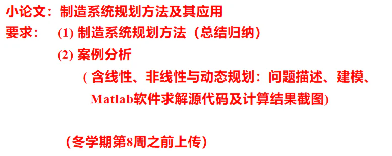
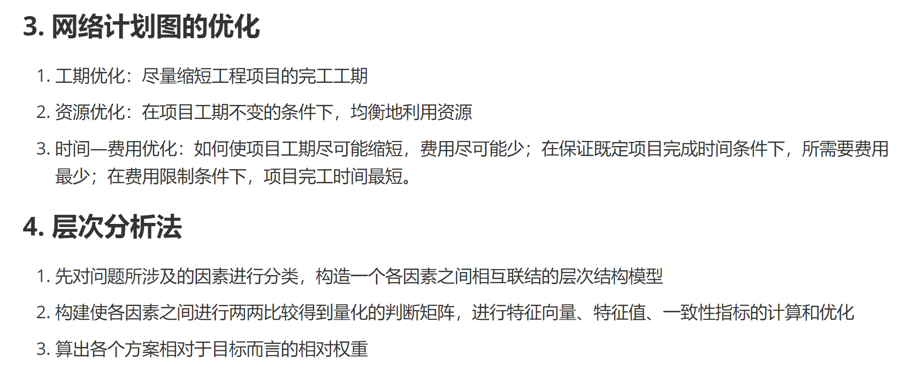
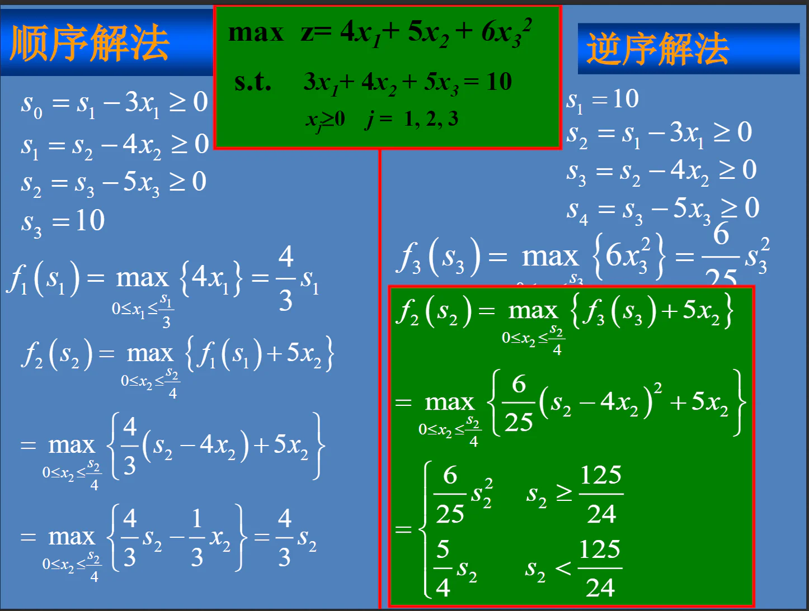
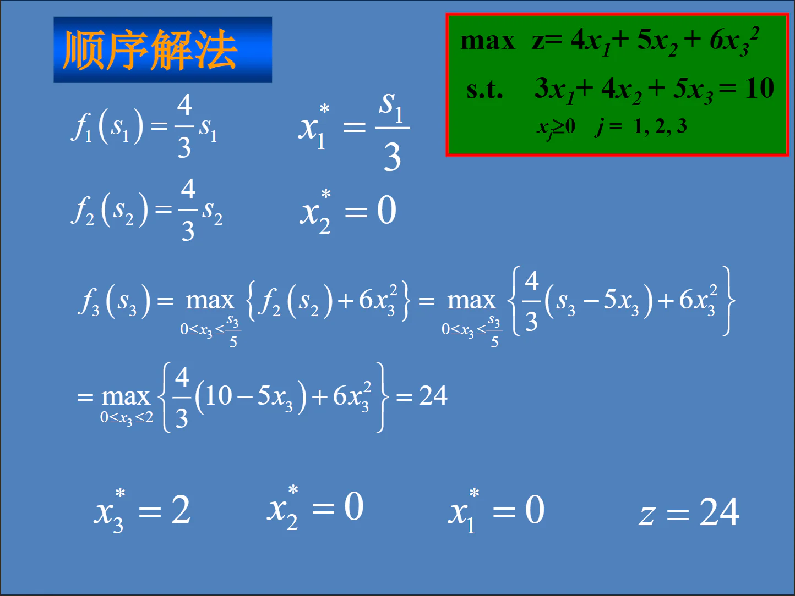
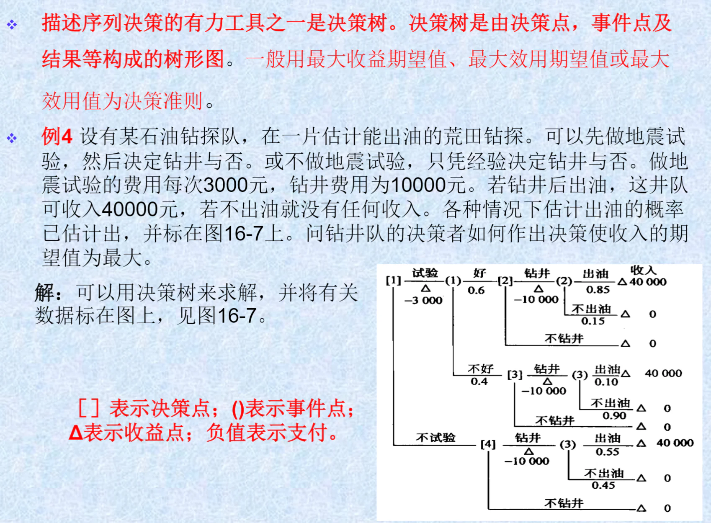

# 制造系统决策与优化

> **课程基本信息**

- 学分：3.0
- 开课学期：秋冬
- 培养方案建议修读学期：大三秋冬

## 历年卷

25-26秋冬无期末考试

[24-25秋冬回忆卷（一）](https://www.cc98.org/topic/6082911)、
[24-25秋冬回忆卷（二）](https://www.cc98.org/topic/6082807)

[21-22秋冬回忆卷](https://www.cc98.org/topic/5236519)

## 笔记与整理

[绿色小狗的学习分享](https://www.cc98.org/topic/5797006)

## 经验之谈

### 笔蔓越莓莓（24-25秋冬）

> **[查看原帖](https://www.cc98.org/topic/6110866/2#6)**

制造系统决策与优化是制造系统管理模块的一门专业课，我不是制造系统管理模块的，所以选了这门课凑专业选修课程的学分，但我看新的培养方案好像去掉了制造系统管理模块，而且制造系统决策与优化这门课变成了2学分（原来是3学分）并且变成了选修课程。为了供后来人参考，还是写一下学习感悟。

甘春标老师人很好，很关心学生。成绩构成是平时考核（考勤、作业）30%，案例分析小论文20%，期末考试50%。上课可能比较难，但考试真的很简单，题目跟历年卷相似。

每一节课开头都会口头点名。习题解答老师会在一开始发到群里。我的作业跟习题解答的答案几乎一模一样（因为我就是照着写的），但是作业均分只有91分。我以为是老师判定我抄袭，所以有一次我就写得比习题解答内容更多更完整，但也只有92分。后来才知道老师基本不会给满分，90分以上已经算不错了。

案例分析小论文要求如下，写起来还是蛮轻松的。但我只有86分。感觉老师打分区间大概就在80~90分。

期末考试的题型是四道简答题和四道计算题。简答题为线性目标规划、非线性规划、网络计划、多目标决策。计算题为单纯形法和对偶单纯形法、动态规划、图与网络优化、单目标决策。大家可以看一下98上的两份历年卷，题目基本一样。除此之外老师会在秋学期结束和冬学期结束分别进行一次整体梳理，要着重复习老师的这两份复习PPT。

推荐这两份历年卷，感谢8u整理！

> [2024-2025秋冬《制造系统决策与优化》回忆卷](https://www.cc98.org/topic/6082911)
>
> [2021-2022秋冬《制造系统决策与优化》回忆卷](https://www.cc98.org/topic/5236519)

下面是各个题目的思路点拨：

- 线性目标规划就是将一个线性规划改成一个线性目标规划，要分清“硬约束”和“软约束”的区别（就是本来就有的不等式与 $x≥0$ 等约束条件，和题目给的目标条件的区别。根据这个区别分出来可行域与满意域）。
- 非线性规划就是构造惩罚函数和障碍函数，这里要注意的点是 $x≥0$ 也是一个约束条件，也要放进构造函数里面，其他的约束条件也要改成 ≥0 的形式。这里可以看一下b站上的视频，会清楚很多。
- 网络计划和多目标决策基本就是背PPT了。最后一节复习课老师会整体梳理一下本课程后半部分的内容，所以简答题背复习PPT上的内容就可以了，尤其要注意老师重点强调的地方。我当时整理了一些老师强调的内容，结果考到了其中的网络计划图的优化和层次分析法。

- 单纯形法和对偶单纯形法对着历年卷的题目练一下。单纯形法从原始可行解出发（满足所有约束），通过基变量替换逐步逼近最优解（先保证可行性，再优化目标）。对偶单纯形法从对偶可行解出发（检验数满足最优条件，但原始问题可能不可行，就是b那一列存在负值），通过迭代恢复原始可行性，做题的时候不是对原问题的对偶问题进行单纯形法，而是直接对原问题进行对偶单纯形法。题目是求max的时候，约束条件是小于等于0的，题目求min，约束条件大于等于0（可以直接理解一下）。同理，检验数可以简单记忆为当变量前面是检验数这个系数时，只有变量为0才能达到最优值，所以题目求max时，所有检验数 ≤0 → 达到最优（若有正检验数则目标值可提升）；求min时，所有检验数 ≥0 → 达到最优（若有负检验数则目标值可降低）。
- 动态规划也对着历年卷的题目练一下，掌握顺序解法和逆序解法两种解法，一般像例题这样的平方项在末尾就用顺序解法。格式要标准，尤其是max（或min）下方一定要加约束条件（如 $0≤x_1≤s_1/3$）！

- 图与网络优化有点像小学奥数竞赛的题目，比较有趣。最近考的都是最小费用最大流问题。打个比方，最小费用最大流就是用最小的费用运输最大的货物，从起点到终点由很多分叉交织的小段路组成，每一小段路都会收过路费，比如说运一吨货物要五块钱，但每一小段路都有额定的不能超的载货数量。核心思想就是先找一条从起点到终点的最便宜的路（最短路问题），在不超过额定载荷的情况下一次性运送最多的货物，然后找第二便宜的路，在原来的基础上增加运送的货物量，然后是第三便宜的路……最终找不到可以增加货物而不超过额定载荷的路了（最大流问题），优化就结束了。
- 单目标决策是最最简单的一道大题，一般来说你不学运筹学这题都会做，所以考试考察的就是决策树思想和整体答题格式。把老师复习PPT里的钻石油问题的答题思路练几遍就好了。

