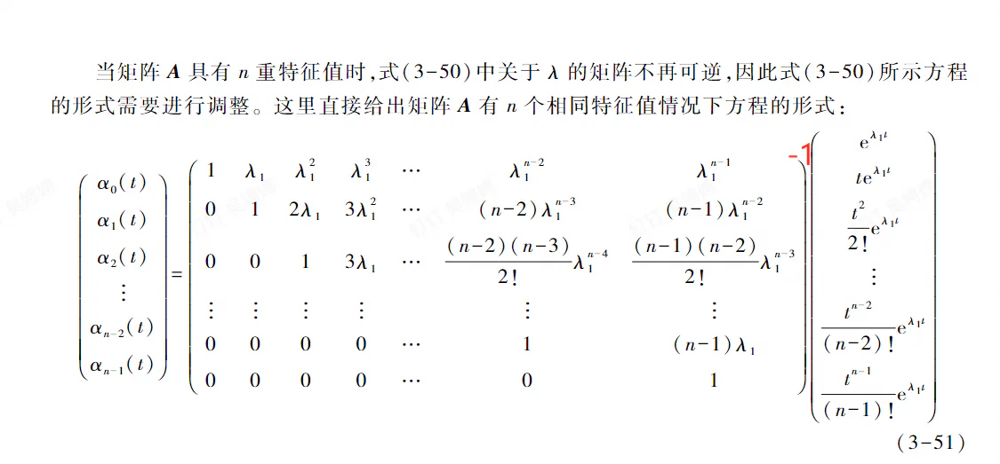
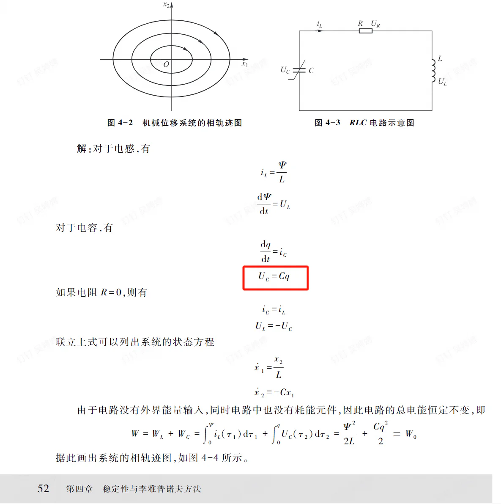
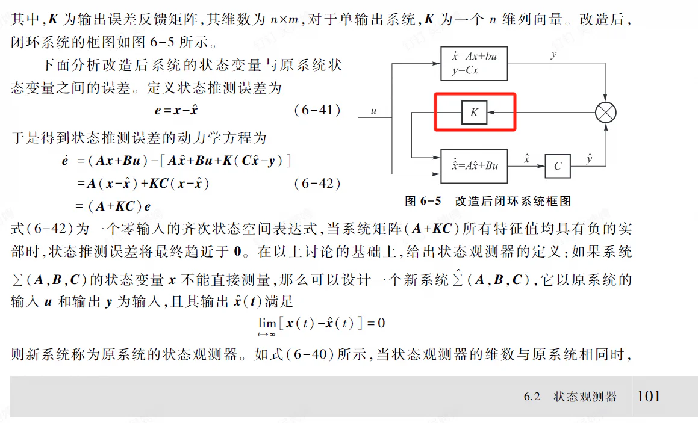

# 线性系统与数字控制

> **课程基本信息（23级）**

- 学分：3.0
- 开课学期：春夏
- 培养方案建议修读学期：大三春夏

> **《机电现代控制基础》课程基本信息（24级）**

- 学分：1.5
- 开课学期：春
- 培养方案建议修读学期：大三春

> **《数字控制系统》课程基本信息（24级）**

- 学分：1.5
- 开课学期：秋
- 培养方案建议修读学期：大四秋

> **课程调整：23级及以前，这两门课是同一门课，叫《线性系统与数字控制》，因此资源汇总时也按同一门课来**

## 历年卷

[24-25春夏回忆卷](https://www.cc98.org/topic/6172756)

[23-24春夏回忆卷](https://www.cc98.org/topic/6168186)（含启真湖散人的半开卷参考）

## 笔记与整理

[Makeup的半开卷参考](https://www.cc98.org/topic/6184793)

## 经验之谈

### 笔蔓越莓莓（24-25春夏）

> **[查看原帖](https://www.cc98.org/topic/6229120/1#4)**

线性系统与数字控制分为春学期的线性系统和夏学期的数字控制，各占50分。春学期的线性系统由刘涛老师上，平时作业占比20%，考试占比80%。夏学期的数字控制由雷勇老师上，平时作业占比20%，大作业占比80%。

线性系统的教材是刘涛老师自己编的讲义《机械电子工程现代控制基础》，很薄，基本跟PPT内容可以对上，每章结束还会布置作业，虽然网上搜不到答案，但可以让AI做，AI做这种类型的题基本是正确的，学习体验还是不错的。而且线性系统的一部分知识与《机械系统动力学》重合，巩固了对《机械系统动力学》的理解。

但是，《机械电子工程现代控制基础》这本讲义有不少错误，不知道会不会再印一个修订版。以下是我发现的几个错误（除此之外可能还有其他错误），同学们复习的时候注意一下不要弄错了。

（1）p46少了个逆矩阵的符号

（2）p52的电容电压公式有错

（3）p101的闭环系统框图是有错的，框图上负号应该在 $y$。除此之外，其他参考书的输出反馈矩阵都是 $-K$，只有这本讲义是 $K$，但是既然书本前后都一致，作业也写的是 $K$，那就按照书上的输出反馈矩阵是 $K$ 吧。

线性系统考试是半开卷，可以带手写A4纸，之后我也会上传我的半开卷材料。考试时间不在教务系统安排，而是同学们投票选有空的时间，我们这届考试是夏二周。

说到这，刘涛老师还会选一个班长，负责平时的消息通知、考试时间确定，我们这届的班长就是114_514。

历年卷：[24-25春夏回忆卷](https://www.cc98.org/topic/6172756)、[23-24春夏回忆卷](https://www.cc98.org/topic/6168186)。

其中6道3分的简答题让同学们大惊失色，老师说不能单纯地写一个“是”或“否”，而是要简单论述，可见对课程知识理解的重要性。我也写了将近四十分钟才写完简答题，感觉时间也是很紧。大题看上去简单，但是计算量很大，尤其是求传递函数时需要求逆矩阵和判断能控能观时的矩阵乘法，很容易出错。最后一道大题比较难，作业题是没有的，但是例题有，第一小题是加入状态反馈配置极点，第二小题是设计全维状态观测器配置极点，第三小题是画出加入全维状态观测器后的闭环系统，建议直接把例题6-4抄在A4纸上。

数字控制的PPT和作业都是全英文的，但是老师是用中文讲的。数字控制没有教材，只有英文参考书籍和老师的英文PPT。可以看出雷勇老师是很想把课讲好的，人也很好，但是英文PPT我真的看不懂。每次只能一边听一边用app翻译PPT，而这个翻译也很不精准，被控对象plant老是给我翻译成植物。总之一学期下来，我是没听懂多少课的。平时作业更是不会做，只能用AI做，然后跟着AI的解题过程学。大作业一般在夏七周布置，然后在浙大的考试周快结束的时候上交，我们这届的题目是板球系统和倒立摆二选一，可以在网上找到很多参考资料。一个小组不超过3个人，最好2个人。由于我只有三门考试，又有2位靠谱的队友，感觉还是来得及在ddl前完成的。最后出分也很快，给分也很好。

### 只因蟹（23-24春夏）

> **[查看原帖](https://www.cc98.org/topic/6129809)**

机电s中s三巨头之一。这门课其实是两门课缝在一起的，前半段是现代控制理论，结束以后有一个考试；后半段是数字控制技术，最后没考试有个大作业。总的来说，前半段好好学还是能学到东西的，体验还可以。后半段，由于老师是英文授课，并且课程内容也比较多，lz上下来感觉蛮吃力的，最后大作业也没有做出来很好的效果，收获挺一般的。但是最后分数还是出乎了lz预料（？）

### 八抄（22-23春夏）

> **[查看原帖](https://www.cc98.org/topic/5648623)**

这门课其实可以分成两门课设计，前半学期和后半学期没有关系。春学期上的是线性系统，由刘涛老师上；夏学期上的是数字控制，由雷勇老师上。

先讲线性系统：课程还是比较硬核的，需要较好的前置知识（控制工程基础）。要是上课能够跟上老师的思路，整体的听课体验在机械的众多课程中不差。考试是半开卷，可以带一张A4纸，这里相对于后面的计算，个人感觉太着重于考前面一些概念性的东西了，建议准备时一定要搞清楚各种概念，占比还是很大的。个人认为速成不是很简单，但A4纸抄的多没准会有奇迹。

然后是数字控制：上课使用英文ppt，水平有限（指的是我自己），大部分时间找不到上课节奏。有一到两次的课后作业，可以参考上课给出的参考资料进行学习。考核方式是大作业，会在第七周具体讲解，有给定题目，也可以自己选题。时间比较充裕，会在考试周的中期截止，具体取决于上传教务网的截止时间，这个老师给的ddl还是很后面的。推荐搜索引擎GitHub，因为课上主要讲的是理论知识，具体的操作没有涉及，这部分需要自己学习，但是难度不是很大，一天能速成粗糙版的，根据本届的考试周时间安排，留到考试周也完全有能力做完。