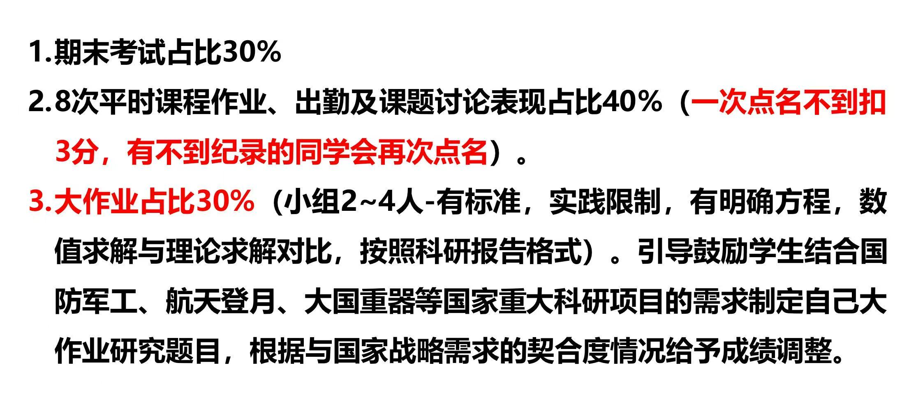

# 工程数值方法

> **课程基本信息（23级）**

- 学分：2.0
- 开课学期：夏
- 培养方案建议修读学期：大二夏

> **课程基本信息（24级）**

- 学分：3.0
- 开课学期：春夏
- 培养方案建议修读学期：大二春夏

## 历年卷

[24-25夏回忆卷](https://www.cc98.org/topic/6221600)

[23-24夏回忆卷](https://www.cc98.org/topic/5927103)（含启真湖散人的半开卷参考与复习资料）

[22-23夏回忆卷](https://www.cc98.org/topic/5634856)

[纸鹭出的一份模拟卷](https://www.cc98.org/topic/6221110)

## 笔记与整理

[纸鹭的速通教程](https://www.cc98.org/topic/6219274)

## 经验之谈

### 纸鹭（24-25夏）

> **[查看原帖](https://www.cc98.org/topic/6170207/1#0)**

这门课的大致情况是：

- 平时作业用MATLAB完成（需自学）
- 小组大作业可以用MATLAB完成，也可以用其他编程语言完成（课外需要花一点时间）
- 期末考试不考MATLAB，而是把你当成MATLAB，用计算器完成给定的任务

考试 **半开卷** ， **可以带一张A4纸（手写或打印均可）** 。考试范围和考试题型比较固定，针对考试的复习不用花太多时间，公式抄在A4纸上即可，对着历年卷过一遍，重点掌握题目的解法（光抄公式不会做题还是不可取的）。

这门课主要是苏芮老师授课，曹彦鹏老师来上了两次。明年曹彦鹏老师可能会单独开班。两位老师上课的时候都会点人回答问题，主要作用是点名 + 提神醒脑 + 复习。令我印象最深的是曹彦鹏老师点名了一位52号同学，该同学对答如流，成为了班上的神话。

虽然不知道明年会改成什么样，但我还是想推荐一下自己的速通教程（考试前还兼作复习楼之用）：[【资源+复习】带你速通《工程数值方法》](https://www.cc98.org/topic/6219274)。

### haaaaaland（24-25夏）

> **[查看原帖](https://www.cc98.org/topic/6232867)**

[折一只纸鹭的工数速通教程](https://www.cc98.org/topic/6219274)无可挑剔，只能叫一声大爹！成绩构成：

期末考A4纸开卷，打印鲍叔资料即可。平时作业是书本课后习题，提交代码与最终结果的截图制作成pdf文档即可，开放性较强，最终结果合理就给满分了，ds在matlab方面确实很牛逼，谢谢ds。大作业自由组队4人，在最后一两节课上需要制作ppt进行成果汇报pre（此时可以没完成，但是需要汇报当前进度）。大作业最终截止时间在考试当天。感谢我组到了很好的三个队友，一起完成了大作业，最终结果也不算太糟糕。苏芮老师日常会点名回答简单的问题，帮助巩固知识点顺便算作点名了，因此上课一定要去。

### 笔蔓越莓莓（23-24夏）

> **[查看原帖](https://www.cc98.org/topic/5933906/3#5)**
>
> 编者注：原帖中展示考试大纲的图片用markdown语句重新写了一遍

工程数值方法是一门需要自学MATLAB的课。期末考内容是上课的内容，主要是数值分析的方法，侧重于理论和公式。平时作业是用MATLAB完成的，相当于告诉你理论，但不告诉你如何使用MATLAB，倒逼你去自学。

短学期课程，大部分是苏芮老师上的，曹彦鹏老师来上了两节课，感觉两个老师的上课风格很像，都是上课刚开始的时候快速复习上节课的内容，快下课的时候总结这节课的内容。会点人起来回答问题，但是答不出来也没事，主要是为了点名和提神醒脑。最后给分是苏老师负责给分，只能说无敌无敌好！学在浙大上提前公布了总评，68个人里52个人90+。

平时分（考勤+作业）40%，大作业30%，期末考30%。平时作业就是书上的课后习题，有的时候会是老师单独布置的思考题。课后习题老师在学在浙大上发了整本书的英文答案，思考题网上都能找到，实在不会就用gpt。一路下来稳扎稳打，平时分拿满没有问题。

大作业是自由选题，用MATLAB解决一个工程问题，我们组当时是做的人脸识别。大作业课堂展示互评30%，报告打分70%。我们展示做得不太好，互评分也有90分，报告认认真真地写了，老师给了97分，所以最后大作业是94.9分。

期末考试是半开卷，能带一张双面打印（或手写）的A4纸。说实话，一个学期下来我能听懂的课很少，全靠期末复习（写到这里我发现，其实一个学期下来没有一门课是我能完全听懂的，所以期末复习很重要，而且要有信心），后来期末卷面成功拿了100分。期末考不考MATLAB的使用，而是把人当作MATLAB，考察理论。

考试大纲如下：

1. 数值计算误差、有效数字（3小题）（15分）
2. 线性方程组求解（雅各比迭代法和高斯-赛德尔迭代法）、向量范数、矩阵条件数（3小题）（15分）
3. 拉格朗日插值、牛顿插值（插值）（10分）
4. 二分法、牛顿法求解（非线性方程求根）（15分）
5. 最小二乘法（曲线拟合）。（15分）
6. 数值积分（中点法、梯形法、辛普森法则等）（15分）
7. 欧拉法、经典龙格库塔法（数值常微分方程）（15分）

期末复习我对着考试大纲看了三遍PPT，第一遍边看边整理半开卷材料。整理完了之后打印，然后手抄一些例题。例题的具体解法过程一定要抄！只抄公式的话期末考容易混淆，或者无从下笔，对着自己抄的例题就方便很多。有效位数判断、两个迭代法、两个插值法、牛顿法、最小二乘法、复合梯形法、复合辛普森法、欧拉法、四阶龙格库塔法我都抄了具体的例题，效果很好，考场上对着写就行。还有精度的证明，老师PPT上这一点不是很清晰，但是历年卷有考到，我就抄了精度判断的一句定义和前进欧拉法和后退欧拉法的精度证明。我们这次考试考的是改进欧拉法的精度证明，我直接用了前进欧拉法和后退欧拉法的余项相加证明了改进欧拉法是二阶精度，大部分人这里都是没写出来的，学弟学妹们可以注意。

我们当时的试卷可以看这个链接，这位同学整理得非常详细~

> [2024-春夏-工程数值方法考试回忆卷](https://www.cc98.org/topic/5927103)