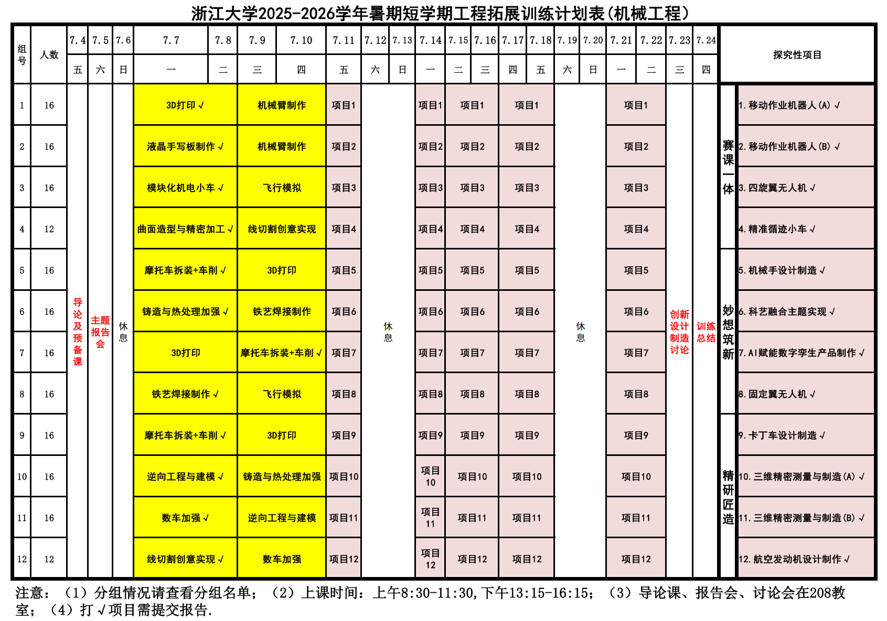

# 工程拓展训练

> **课程基本信息（23级）**

- 学分：2.5
- 开课学期：暑
- 培养方案建议修读学期：大二暑

## 经验之谈

### 纸鹭（25暑）

> 原帖略

24级把这门课改成了《设计制造实践》（3学分），内容估计会丰富一点。如果23级有同学还没修的话，就要修这门新课了。

《工程拓展训练》，顾名思义就是《工程训练》的升级版。整个课程持续 20 天（不过有几天是导论或讲座，另外周末也是休息的，所以实际的实践时间是 12 天），每位同学在 12 个大项目中选择其一，组成小组（一般是 3 或 4 个四人小组，所以一个项目的容量是 12 或 16 人），共同完成实践任务。

我们这年的教学安排如下：

> 7月6日没安排任务真是太感激了，因为那天我还要考 JLPT 。

从上图可以看出，实践环节是 4 天的小项目 + 8 天的大项目（会根据实际情况调整）。每个大项目的成果展示可以参考这个视频：

- [人家读两年本科就造汽车飞机？我读了四年还在玩泥巴…… | 浙江大学机械工程学院2025大二暑期《工程拓展训练》纪实](https://www.bilibili.com/video/BV1kGbQzTEiq)

值得一提的是，前四个项目属于“赛课一体”，相对而言会累一点（据说移动作业机器人组的同学经常熬夜调参），成绩优异的可以将成果继续完善，参加大学生工程实践与创新能力大赛（工创赛）。

### 推荐阅读

- [一份邀请：一起分享《工程拓展训练》的感受吧！](https://www.cc98.org/topic/6245878)  
- [工程拓展训练 多旋翼无人机 课程感想](https://www.cc98.org/topic/6247217) 

