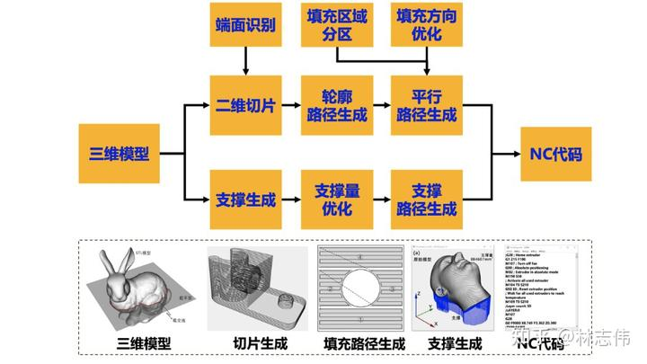
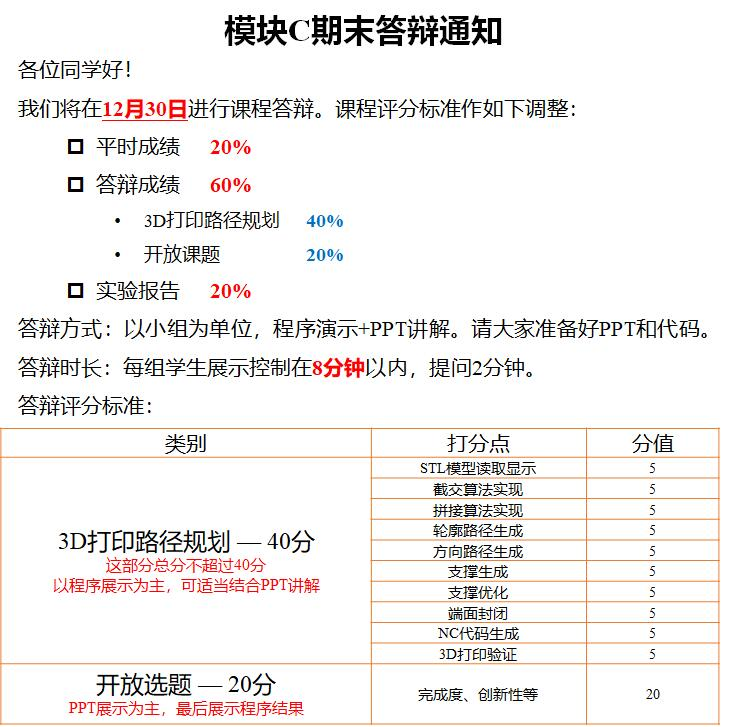

# 机电系统综合实验

> **课程基本信息**

- 学分：2.0
- 开课学期：秋冬
- 培养方案建议修读学期：大四秋冬

## 经验之谈

### 幻影光临（22-23秋冬）

> **[查看原帖](https://www.cc98.org/topic/5233123)**

建议不要选高宇的模块，他一个人带七八个课题，几乎不给指导，就是丢给你一堆材料让你自学，上起来感觉非常难受。

如果有人选了高宇的，又恰好是魔方色块识别，那我的一些经验可以供参考:

1. 这部分内容有点多，需要学很多机械不会教的内容。首先得会至少一点点 **C++**，有 **类** 的概念，然后得学 **qt**（qt可以和c++一起学，用qt学c++还挺快的，b站也有不错的教程），然后得学 **opencv4** 和 **opengl**。opencv网上大部分教程都是python的，很少有c++的教程，不太好学，但其实内核是一样的，简单了解一下什么叫腐蚀、膨胀、特征提取、HSV、RGB等等就差不多了。
2. 选队友很重要。我的队友极度不靠谱，搞的我异常难受。本来我是只负责用qt做ui的，我负责qt + opengl实现三维模型和魔方类这些内容，想让他负责用opencv搞色块识别的具体功能函数实现，然后把识别出的数据反馈给我这边，我再整合一下，最后他在csdn上下载了一份代码发给我，我估计他都没在自己电脑上跑成功，发给我的效果图和原帖一模一样，简直把我当傻子，我试了之后也发现完全用不了，原因是库版本不一致，我下载的是opencv4.x的库版本，他在csdn上下载用的程序版本为opencv2.x，最后只好ddl最后几天我让他来实验室跟我一起坐着写代码，结果他连电脑都不带，就过来干坐着，我真的气炸了，问他他就说是在自己寝室主机电脑上装的库和环境，电脑带过来也没用，我严重怀疑是借口，最后我在帮他重构他在网上抄的代码，他坐在旁边玩手机，连续三天，整个工作下来他就写了个报告做了一部分PPT，而我负责了几乎整个程序的编写，一共接近两千行代码，并且展示也是我上，只能说又是组队体验极差的一次。
3. opengl并不是必学的，可以不用opengl画三维模型。这部分其实挺麻烦的，很多组都没做，只做了二维展开六面的平面图，似乎只有一个大佬的组和我们组做了这个，我花了四天泡在图书馆学opengl才搞定这部分，我觉得不慎入坑这个破模块又没有大佬带飞的同学最好别浪费这个时间了，我看到别的组都没做这个后悔死了。
4. 配环境很麻烦，vs + qt + opencv + opengl的环境一点都不好配，在vs里不好配opengl，在qt里不好配opencv，光是配环境浪费了我好几天。建议初学者先用qt + opengl做主环境，最后再在vs里装那个qt插件，之前在qt里编译通过的项目就可以直接在vs里跑了，最后再在vs环境下装opencv库（本人就是这个路线）。

最后，还是建议别选高宇，不如左转隔壁林志伟老师的模块（见下文），或者考虑那个四周的模块A（好像是做慧鱼机器人）。我两个室友上的这个，听他们说那几天确实比较累，但是四周每周只用一两天就可以结束，痛苦不会持续很久，而且目测指导应该比高宇多，体验感估计比魔方这个好很多。

### 亦有情（22-23秋冬）

> **[查看原帖](https://www.cc98.org/topic/5546315)**

#### 基本情况介绍

机电系统综合实验（58120260），机械大四上专业课，2学分64课时。选课时会在学院自己的一个实验网站上选，注意时间通知，一般是在正式上课前夕。总共分为若干个模块，不同模块上课时间有所不同，有的是16周每周上三个多小时，有的是集中四周上完。

需要注意选模块是先到先选，去年的时候通知那天刚好在搬寝室，没有关注以至于没有过多选择（没有选择了其实），只有模块C——基于Python的三维打印路径规划可选了。此模块的课是上16周，每周上三个多小时。当时在准备考研想上一个四周搞完的实验课，却没有余量了。但也应该是天意如此，此模块上完后觉得体验非常不错，故写此帖为林志伟老师推荐该模块，希望学弟学妹们在之后把这个课的容量选满（）。

#### 关于为什么推荐

1. 参考资料丰富：这是我三年多以来上过资料最丰富实验课，课上讲授、PPT、参考教材、学在浙大慕课一应俱全，所用资料均是林老师亲自编写或参与录制；
2. 基础内容讲授细致：对于基础计算几何库搭建一部分讲的尤为细致，对于基础不好的同学很友好；
3. 课上实践时间多：前几周讲基础的东西讲的比较多，可能实践时间少一些，到后面基本上都会留出一个小时去实践、自主学习；
4. 答疑：林老师对于我们的问题都是有问必答，无论问题多简单也会耐心给我们解答；
5. 趣味性、系统性、基础性、科学性、实践性、拓展性兼具（林老师知乎写的）

> [林老师的知乎链接](https://www.zhihu.com/column/c_1485242146865799169)

#### 课程内容

1. Python简介
2. 基础几何库搭建
3. 几何可视化平台搭建
4. STL模型切片轮廓计算基础
5. STL模型截交计算优化
6. 截交线段拼接计算优化
7. 基于拓扑模型的切片轮廓计算
8. 轮廓平行填充路径生成
9. 方向平行填充路径生成
10. 支撑生成与优化
11. 端面封闭与代码生成

#### 考核方式

考勤 + 课程代码运行展示 + 拓展创新项目（1~2人一组） + 实验报告。

其中主要展示如下图的内容，本来还应有3D打印验证，疫情原因就取消掉了。

#### 一些碎碎念

总的来说，对于我一样基础不太好的难度是有的，课程内容其实也比较多，还是需要课后多去实践。去年准备考研实验课积压了不少内容，考完后那几天也是狂肝，还是没赶上实验课第一次答辩，被一个bug卡了很久，后来也是问了林老师三次才找到原因，幸好后面宽限了几天赶上实验课第二次答辩（那段时间也赶上开题答辩，事情挺多的）。挺感谢林老师的帮助，希望能有更多的人来选这个模块。

今天水98发现了林老师之前的帖子：

- [新书推荐：计算机辅助制造实践——Python实现三维打印路径规划](https://www.cc98.org/topic/5058937)
