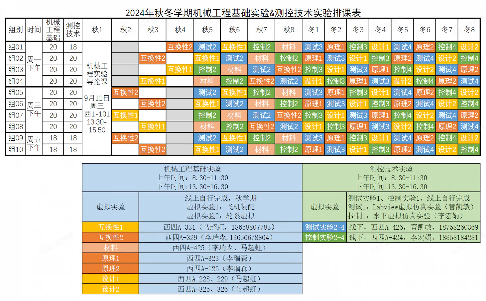
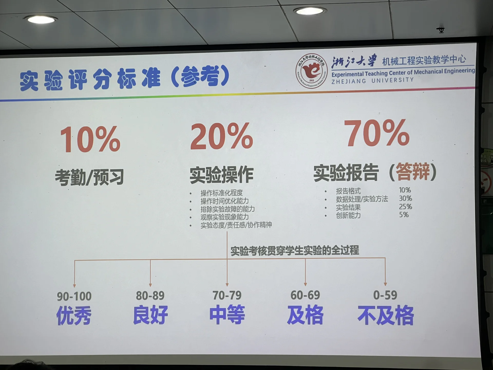
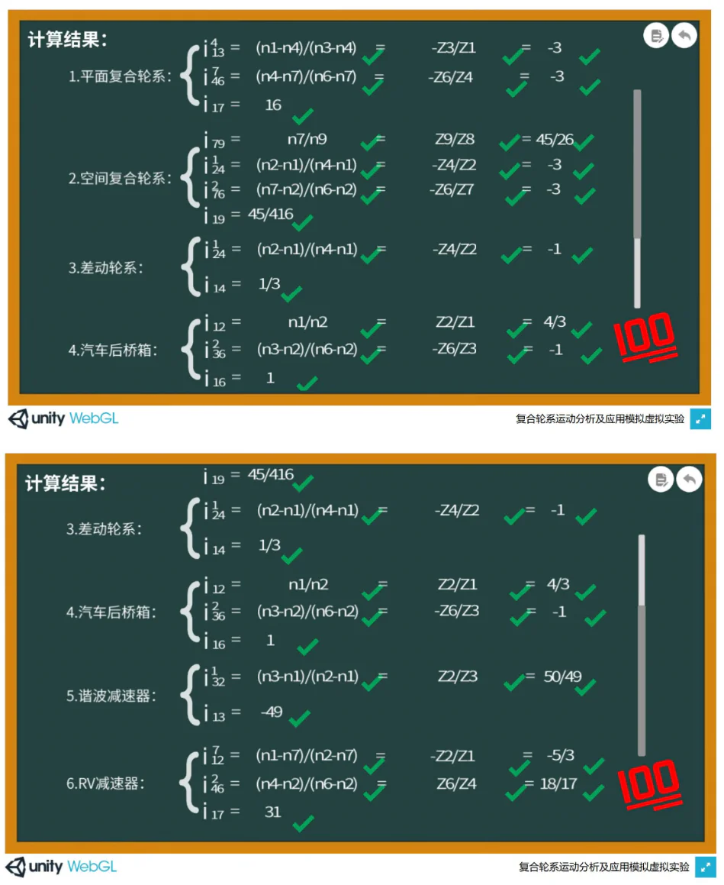
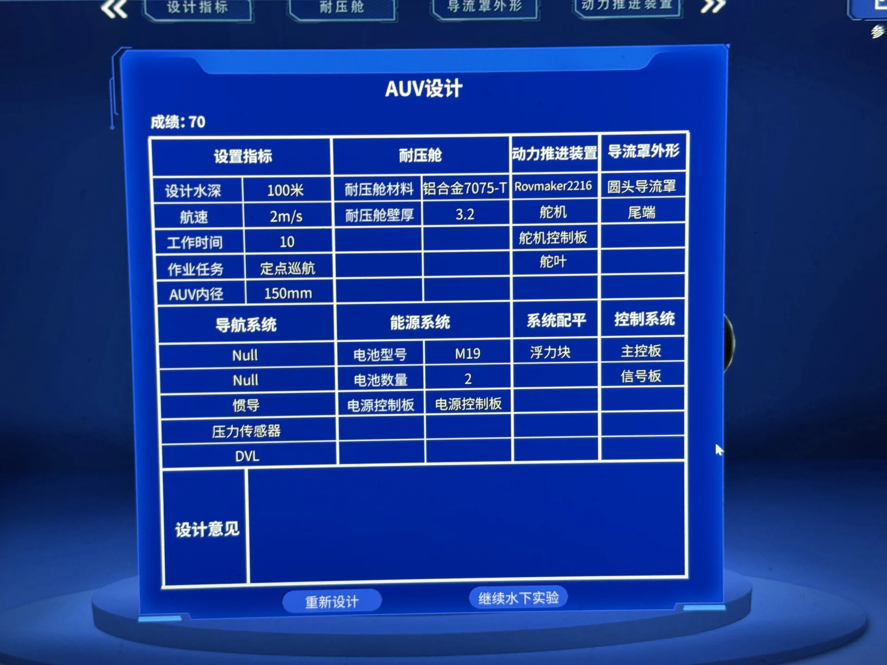

# 机械工程基础实验 & 测控技术实验

> **课程基本信息**

- 学分：1.0 + 1.0
- 开课学期：秋冬
- 培养方案建议修读学期：大三秋冬

> 这两门课有课程联排，大概可以看作同一门课，因此放在一起

## 经验之谈

### 纸鹭（25-26秋冬）

> 原帖略

先讲述一下整体情况，与笔蔓越莓莓学姐所述（见下文）一致，这两门课会进行联排调整，并不按照教务网上的课表来（我们这届是周一上午和周三下午），而是每周固定一个半天做实验（ ~~所以为什么不把这两门课合并一下~~ ）。 **不得不说，周五下午做实验真的牢完了，因为经常和其他活动冲突** 。评分规则也是一样，五级制，且成绩几乎全部由实验报告决定。

大多数实验是两人一组，共享实验数据，各自独立分析（少数实验允许两人共享实验报告）。所以， **一个靠谱的队友还是蛮重要的** 。

《机械工程基础实验》涵盖工程材料、互换性、机械原理、机械设计，由李瑞森老师和马超虹老师授课。《测控技术实验》涵盖机械工程测试技术、控制工程基础，由李宏娟老师和管凯敏老师授课。

下面浅谈一下各个实验给我的感受。

#### 虚拟1：飞机头（虚拟）

需秋学期完成。这个虚拟实验的体验不佳，失败率高（漏步骤导致总分不足100就得重来），且有bug（某个地方完成任务后有概率无法触发下一个任务，需要多试几次，忘记是哪个地方了，应该挺靠后的），并且还有概率卡死。可以做好几次刷分，但是性价比不高，做一次要花半小时的事情暂且不谈，做了大半段然后来个卡死岂不是轧钢了？

#### 虚拟2：轮系（虚拟）

需秋学期完成。 ~~要是能在学机械原理的时候做这个该多好~~ 。做这个实验的时候，我的机械原理知识已经忘得差不多了，所以做起来还是有点吃力的。计算结果可以参考 笔蔓越莓莓 学姐（见下文）。

#### 互换性1：形位误差

马老师授课。围绕形位误差，做 直线度测量 与 平面度测量 两个实验，不难。 ~~感觉像是落后于时代的测量方式~~ 。

#### 互换性2：粗糙度、齿轮

李老师授课。粗糙度有两个实验：光切法显微镜测量、表面轮廓仪测量。齿轮有两个实验：齿形测量、齿轮综合测量。

光切法似乎比较难调（想起了大物实验被分光计支配的恐惧），以及有点费眼睛。其他三个实验比较简单，按照PPT的步骤做就行（PPT是在实验室打印出来整理成册并放置在各个实验台上的，翻那个文件夹就行）。

齿形测量的原理就是渐开线发生原理：当直线相对基圆做纯滚动时，直线上某个定点的运动轨迹即为渐开线。理解这个原理就能很好地理解这个实验的过程。

#### 材料：金相显微分析

马老师授课。这个实验要求 **独立完成** 。面对面的两位同学为一组，其中一位同学拿到的是实验一的试样，另一位同学拿到的是实验二的试样，各自完成自己的实验后将试样互换。所以，这个实验虽然也有分组，但分组的意义在于共享试样，实验是要独立完成的。

这个实验是最让我迷糊的，因为工程材料的理论课在大二秋学期，而这个工程材料实验却在大三秋学期，所以理论与实验的割裂感很重。

据考拉老师（李埛其老师）所说，金相显微分析最重要的其实不是观察试样，而是制样的过程。因为试样的观察与分析可以用自动化脚本完成（毕竟就是一个二值化），而切片、打磨、浸蚀的过程才是真正有门道的地方。据说明年这个实验会由考拉老师授课，可以期待一下。

#### 原理1：凸轮、回转件动平衡

李老师授课。这两个实验比较简单，做下来比较快，顺利的话一个半小时就能完成。

凸轮实验有两个，一个是根据直动从动件的位移与凸轮基圆半径绘制凸轮轮廓（复习一下反转法），还有一个是根据摆动从动件的角度绘制凸轮轮廓（由计算机完成数据记录，分析的时候只要用示意图说明如何画这个轮廓即可，不需要把轮廓画出来）。

理想的回转件应当是质量均匀分布的，但是实际的回转件会因为各种因素（如材料缺陷、制造误差、结构不对称等）而产生不合理的质量分布，因此需要对回转件进行动平衡校正。因为实验所用的回转件近似满足动平衡，所以我们给回转件吸两块大一点的磁铁，以此模拟不平衡的场景，之后再用小一点的磁铁慢慢对其进行校正。

#### 原理2：机构组合实验

李老师授课。实验指导书给了十个机构简图，要求从中选一个机构简图，并用实验室的材料搭建这个机构。这个实验还蛮有意思的，尤其是全都搭建完毕后启动电机看机构运动的样子，总觉得要是上个学期学机械原理（设计与制造二）的时候能做这个该多好。另外就是，实验室里还有机械原理陈列柜，像连杆机构、凸轮机构、各种轮系等都有涉及，并且还可以看它们运转。还是那句话，如果学机械原理的时候能来这里看一下该多好。

另外一个测绘挺简单的，略去不表。

#### 设计1：齿轮效率、液体动压

马老师授课。这两个实验比较简单，做下来比较快，顺利的话一个半小时就能完成（我们甚至还做了两遍，这才一个半小时）。注意 **两个实验的实验台参数都要按老师所说的来** ，因为和实验指导书不一样。

齿轮效率的实验就是开机、加载（添加载荷）、软件采集并分析数据、打印，做的很快。液体动压实验有两个，一个是先加转速再加载荷，读取表压；另一个是先加载荷再加转速，读取显示器上的数据（因为有急剧变化，所以开始的时候要慢慢增加转速，并且把显示器的数据变化用视频录下来）。

#### 设计2：齿轮减速箱拆装、机械传动

马老师授课。这两个实验同样比较简单，可以做的比较快，与机械设计（设计与制造三）的理论课相得益彰，意义比较大。齿轮减速箱貌似就是大三春夏《机械设计课程设计（甲）》的大作业内容。至于机械传动，你能在这里见到带传动、链传动、齿轮传动、蜗杆传动等各种传动方式，并且 **注意观察它们在减速系统里的排列顺序** （主要是和设计与制造三的相关知识呼应起来）。一般而言，带传动位于高速级，齿轮传动位于中间级，链传动位于低速级。

#### 测试1：Labview 虚拟仿真实验（虚拟）

这个实验最难绷的地方是，Labview 的安装实在是太！慢！了！不知道是不是因为我没找对安装包，它居然足足安装了两个小时！这对吗？

我没按照实验指导书上的方法下载，用的是这个：[LabVIEW 2018软件下载和安装教程](https://cloud.tencent.com/developer/article/2161174) （感谢 Mourn）。

Labview 一共两个实验，第一个实验是用来熟悉软件操作的，实验指导书可以说是手把手教了。第二个实验只给了参考图，需要自己找组件完成搭建。倒也不是很难，主要还是那些思考题吧。

#### 测试2：传感器综合实验（一）

这个实验要做三块内容：应变片、移相器、相敏检波器。

首先是应变片。我们在机械工程测试技术和材料力学实验中学过，应变片有三种接法：全桥、半桥、四分之一桥。这三种接法的灵敏度比值为 4:2:1。另外，这里还要根据电路图计算差动放大器的放大倍数（用好“虚短”和“虚断”就行）。

然后是移相器。同样的，根据“虚短”和“虚断”可以得出移相器的传递函数 $G(\text{j}\omega)$，然后就会发现它的模长为1，而相角与变阻器的阻值有关。不过需要注意的是，“相位差”一般都指 $\phi(U_\text{out})-\phi(U_\text{in})$，但是实验所测的是 $\phi(U_\text{in})-\phi(U_\text{out})$，所以理论值与实验值之间有 $\pi$ 的相位差。

最后是相敏检波器。同样的理论分析，不再赘述。（ ~~不过我一直没弄明白相敏检波器有什么用~~ ）

#### 测试3：传感器综合实验（二）

这个实验要做两块内容：差动变压器、霍尔传感器。

按实验指导书和老师说的做就行。 **看清楚自己的实验台，差动放大器 Ⅱ 到底是顺时针增益最大还是逆时针增益最大** ，有的实验台因为比较新，其增益方向与指导书上的相反，所以请务必再三确认！（至于我为什么要强调这一点，那就是一个悲伤的故事了）

#### 测试4：位移实验 or 振动实验

似乎和去年的测试4完全不同，是两个全新的实验，不知道明年会不会变。这两个实验意义不明，纯浪费时间。

#### 控制1：水下机器人虚拟仿真实验（虚拟）

这个实验不用交报告，只要在实验平台上提交成绩就行。如果无法提交，就把成绩截图上传到学在浙大。设计可以参考 笔蔓越莓莓 学姐。

#### 控制2：典型环节的电路模拟与软件仿真

这个实验就是探究控制工程里的一些典型环节（如比例环节、积分环节等，用电路实现），拿实验结果与 MATLAB Simulink 的仿真结果比较与分析。

#### 控制3：典型系统的时域特性和频域特性

依旧控制工程，与控制2的区别在于，这次不用 MATLAB Simulink 仿真，而是用脚本仿真。主要的难点在于脚本仿真，写代码没那么容易，建议在老师放 example 的时候拍个照。思考题挺简单的，就是控制工程的理论课里非常熟悉的概念了。

#### 控制4：线性系统串联校正

建议预习一下，课前先把校正环节和电路图设计好，进实验室直接接线，测完就可以迅速下班。这个实验的核心在于校正环节和电路图的设计，需要回顾控制工程的理论课知识。

### 笔蔓越莓莓（24-25秋冬）

> **[查看原帖](https://www.cc98.org/topic/6110866/2#9)**

这两门课几乎是一门课，我就放在一起总结了。这两门课课表上分别是周一下午和周三下午，实际上不是这样的。而是让你 **在一周里选一个半天，两门课合在一起上** ，我们这届的课表如下：

同样的，这两门课跟电工电子学实验一样，是五级制给分，最多只有30%的4.5，评分标准如下：

实验都是2人一组，一个靠谱的搭子非常重要。 **测控技术实验的座位是固定的，第一次坐哪之后都坐哪了** 。机械工程基础实验就是《工程材料》《互换性与技术测量》《设计与制造Ⅱ》《设计与制造Ⅲ》的实验，测控技术实验就是《机械工程测试技术》《控制工程基础》的实验。除此之外还有几个虚拟实验。

#### 复合轮系运动分析及应用模拟虚拟实验

题目可能会变，可参考：

#### 飞机机头数字化装配虚拟仿真实验

这个实验可以做多次刷分，但做一次可能要半小时，甚至会有卡死的情况出现。

#### 水下机器人虚拟仿真实验

不用交实验报告，实验成绩即虚拟实验平台上的成绩，完成“AUV 设计”、“AUV 水下实验”两个任务。实验速度较快，可以做多次刷分。

这是我的AUV设计参数，可供参考，参数在一定范围内即正确：

